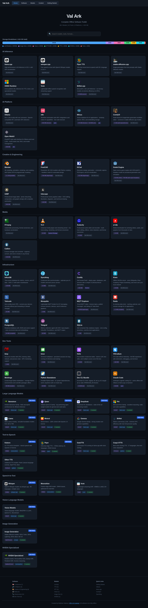
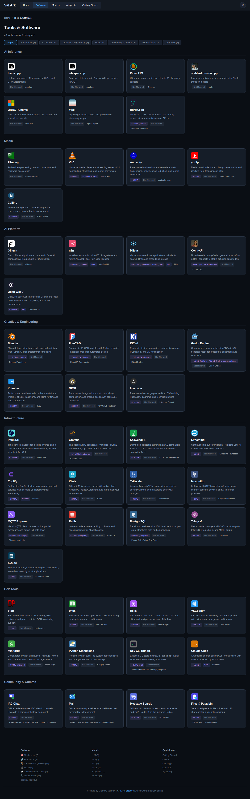
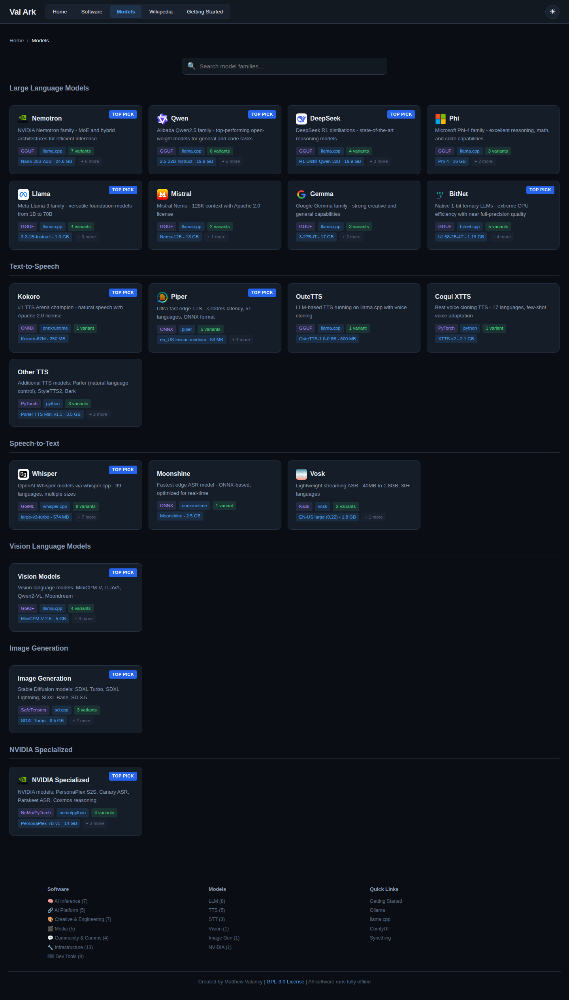
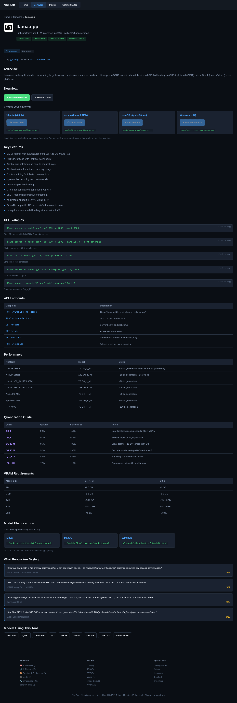
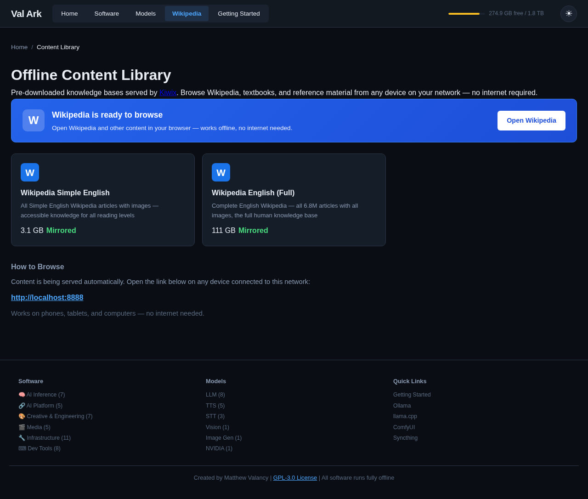
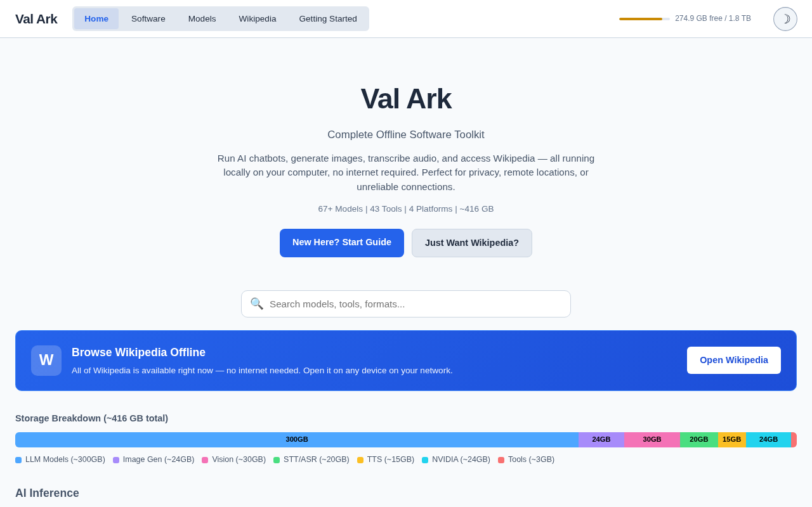
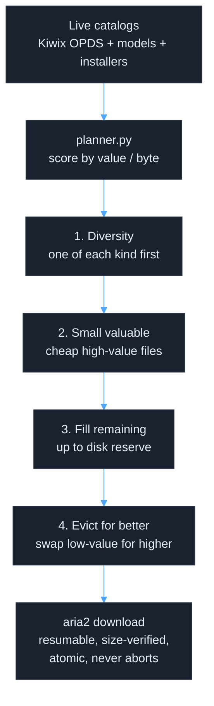

# Val Ark

**Created by Matthew Valancy**

A self-filling, online-optional mirror of 45 dev/AI tools, AI models, and offline
content (ZIM via Kiwix) — plus an offline **community hub** (chat, mail, message
boards, file sharing) — all behind one web UI. Local-first, peer-to-peer,
NFS-shareable, offline-capable — scales to a disk of any size.



<details>
<summary>More Screenshots</summary>

### Software Catalog


### Model Families


### Tool Detail


### Library (Wikipedia, StackExchange, wikis, courses & more)


### Light Mode


</details>

**Contents:** [Architecture](#architecture) · [Librarian](#self-filling-mirror-librarian) · [What's Included](#whats-included-45-tools) · [Community](#community--comms) · [Platforms](#platforms) · [Quick Start](#quick-start) · [Offline & P2P](#offline--p2p) · [Web Server](#web-server) · [Project Structure](#project-structure) · [Documentation map](#documentation-map) · [Testing](#testing) · [Releases](#releases)

## Architecture

```mermaid
%%{init: {'theme': 'base', 'themeVariables': {
  'primaryColor': '#1a2230',
  'primaryBorderColor': '#2a3545',
  'primaryTextColor': '#e8edf4',
  'lineColor': '#4da6ff',
  'secondaryColor': '#131921',
  'tertiaryColor': '#0a0e14'
}}}%%
graph TB
    subgraph Config["Config"]
        style Config fill:#1a2230,stroke:#fbbf24
        ENV["( .env / autodetect )<br/>VAL_ARK_DATA"]
    end

    subgraph Entry["Entry Points"]
        style Entry fill:#1a2230,stroke:#4ade80
        START["start.sh<br/>Interactive Menu + CLI"]
        LOOP["loop.sh<br/>24/7 self-heal (cron)"]
    end

    subgraph Engine["Librarian Engine"]
        style Engine fill:#1a2230,stroke:#4da6ff
        LIB["librarian.sh<br/>fill / verify / evict"]
        CAT["lib/catalog.sh + planner.py<br/>live catalogs, diversity-first"]
        VER["verify.sh<br/>do apps actually run?"]
    end

    subgraph WebServer["Web Server (port 3000)"]
        style WebServer fill:#1a2230,stroke:#fb923c
        SERVER["server.js<br/>web UI + JSON API + SSE"]
        KIWIX["kiwix-serve<br/>loopback :8888, proxied at /kiwix/"]
    end

    subgraph Storage["Data Root (any size, NFS-exportable)"]
        style Storage fill:#1a2230,stroke:#a78bfa
        TOOLS["tools/ — binaries + sources/"]
        MODELS["models/ — AI Models"]
        CONTENT["content/zim/ — Offline ZIMs"]
    end

    ENV --> START
    ENV --> LOOP
    START --> LIB
    START --> SERVER
    LOOP --> LIB
    LOOP --> VER
    LOOP --> SERVER
    LIB --> CAT
    CAT -->|aria2 multi-conn| TOOLS
    CAT --> MODELS
    CAT --> CONTENT
    SERVER --> KIWIX
    KIWIX --> CONTENT
    VER -.->|SSH| MESH["Mesh nodes<br/>mount shared mirror,<br/>GPU inference over NFS"]
    MODELS -.->|NFS export| MESH
```



## Self-Filling Mirror (Librarian)

Val Ark fills a disk of **any size** by itself and keeps it healthy. The
**Librarian** pulls from **live** catalogs — the Kiwix OPDS ZIM library (no stale
dates, ever), a diverse model set, and OS/router/netboot installers — and a
planner scores candidates by value-per-byte, downloading in this curated order:



Downloads use **aria2** multi-connection transfers (~3x faster, curl fallback) —
resumable, retried, size-verified, atomic-renamed, guarded by a single `flock`.
A **24/7 loop** (`loop.sh`) refreshes catalogs (so content links never go stale),
checks and repairs links, verifies file integrity, tops up the fill, and runs
**functional verification** (`verify.sh`) confirming tools, kiwix, a tiny LLM, and
the web API actually run — locally and across SSH-reachable mesh nodes.

```bash
cp .env.example .env            # set VAL_ARK_DATA=/your/disk (git-ignored)
./scripts/librarian.sh plan     # preview the diversity-first fill plan
./scripts/librarian.sh fill     # fill the disk (resumable, never aborts)
./scripts/loop.sh install 30    # flock-guarded 24/7 self-healing cron (every 30 min)
```

Commands: `status | plan | fill | verify | evict | maintain | refresh`.
See **[docs/LIBRARIAN.md](docs/LIBRARIAN.md)** for the full design.

## What's Included (45 Tools)

### AI Inference
llama.cpp, whisper.cpp, stable-diffusion.cpp, BitNet.cpp, Ollama, ONNX Runtime, Vosk, Piper TTS

### AI Platforms
n8n, Milvus, ComfyUI, Open WebUI

### Creative
Blender, FreeCAD, KiCad, Godot, GIMP, Inkscape, Kdenlive, Calibre

### Media
FFmpeg, VLC, Audacity, yt-dlp

### Infrastructure
SeaweedFS, Syncthing, Coolify, Kiwix, Tailscale, Mosquitto, MQTT Explorer,
Redis, PostgreSQL, InfluxDB, Grafana, Telegraf, SQLite, btop, tmux

### Dev Tools
Helix, VSCodium, Miniforge, python-build-standalone, Claude Code,
Dev CLI Bundle (ripgrep, fd, bat, jq, fzf, lazygit)

### Content Library
Offline ZIM files (Wikipedia and much more) served via Kiwix, selected live from
the Kiwix OPDS catalog by the Librarian — so titles and sizes are never stale.

### AI Models
A diverse model set spanning modalities, filled by value-per-byte. `download-models.sh`
also exposes manual tiers:
- **Tier 1 (Edge/Mobile):** Small fast models for phones, tablets, IoT (~15GB)
- **Tier 2 (Workstation):** Balanced quality/speed models (~150GB)
- **Tier 3 (Full):** Largest, highest quality models (~300GB+)

## Community & Comms

Val Ark is also an **offline community hub** — a place to message a friend, mail the
group, post to a board, and share files, all on the LAN with no internet. Each service
runs on the box and is framed inside the web UI (same origin, one port, with a
persistent "back to Val Ark" header):

- **IRC Chat** (`/app/chat/`) — ngIRCd + The Lounge web client
- **Mail** (`/app/mail/`) — maddy SMTP/IMAP, local mailboxes (no internet relay)
- **Message Boards** (`/app/forum/`) — NodeBB on the mirrored Redis
- **Files & Pastebin** (`/app/paste/`) — MicroBin

LAN-only, auth-required, no federation. Enable per service via `VALARK_SERVICES` in
`.env`; the loop keeps them running. See [docs/COMMUNITY.md](docs/COMMUNITY.md) for the
architecture and security model.

## Platforms

| Platform | Arch | Tools dir | Notes |
|----------|------|-----------|-------|
| Jetson Orin / Thor, GB10 Grace-Blackwell | aarch64 | `tools/linux-arm64` | All NVIDIA aarch64 boards share one artifact set; differ only by CUDA profile |
| Linux | x86_64 | `tools/linux-x86_64` | Ubuntu/Debian, optional CUDA |
| macOS | aarch64 | `tools/macos-arm64` | Apple Silicon, Metal acceleration |
| Windows | x64 | `tools/windows-x64` | Prebuilt binaries |
| OpenWRT routers | — | — | Content / sync / infra subset only |

GPU-accelerated llama.cpp, whisper.cpp, and stable-diffusion.cpp need a CUDA
**source build** on aarch64 (no upstream prebuilt binary). See
[docs/PLATFORMS.md](docs/PLATFORMS.md).

## Quick Start

```bash
cp .env.example .env              # optional: set VAL_ARK_DATA (else autodetected)
./start.sh                        # Interactive menu
./start.sh setup                  # Install dependencies
./start.sh serve                  # Launch web UI server (default port 3000)
./scripts/librarian.sh fill       # Self-fill the disk from live catalogs
./start.sh download models tier1  # Edge/mobile models only
./start.sh status                 # See what's installed
./scripts/loop.sh install 30      # 24/7 self-healing loop (every 30 min)
```

Once a node is up, anyone on the LAN can **browse and one-click download** what
isn't mirrored yet — a specific ZIM (including all of Wikipedia), a model, or an
app — from the web UI's **Library**, **Models**, and **Software** sections. Val Ark
makes room automatically under its footprint cap (evicting lower-priority content
first) and the self-healing loop keeps user-requested items filled.

### Add another node — offline, from a trusted Ark

Val Ark is offline-first, so it **self-replicates** without the internet: a running
Ark serves its own source. On a new machine, no GitHub required:

```bash
curl -fsSL http://<ark-host>:3000/bootstrap.sh | bash   # clones + sets up from the LAN
```

The Getting Started page shows this one-liner pre-filled with the host's address.

## Offline & P2P

```mermaid
%%{init: {'theme': 'base', 'themeVariables': {
  'primaryColor': '#1a2230',
  'primaryBorderColor': '#2a3545',
  'primaryTextColor': '#e8edf4',
  'lineColor': '#4da6ff',
  'secondaryColor': '#131921',
  'tertiaryColor': '#0a0e14'
}}}%%
graph TB
    subgraph Internet["Internet (one-time)"]
        style Internet fill:#1a2230,stroke:#fb923c
        GH["GitHub"] & HF["HuggingFace"] & ZIM["Kiwix OPDS"]
    end
    subgraph Server["Val Ark Node (shared mirror)"]
        style Server fill:#1a2230,stroke:#4ade80
        STORE["Data Root<br/>tools / models / content"]
        SYNC["Syncthing"]
        NFS["NFS export"]
    end
    subgraph LAN["LAN / Fleet"]
        style LAN fill:#1a2230,stroke:#a78bfa
        P1["Peer<br/>Syncthing copy"]
        N1["Mesh node<br/>mounts mirror,<br/>GPU inference over NFS"]
    end
    Internet -->|"download once"| STORE
    STORE --- SYNC
    STORE --- NFS
    SYNC <-->|"P2P sync"| P1
    NFS -->|"serve models"| N1
```



Download once from the internet, then share across your LAN. **Syncthing** gives
peers a full P2P copy; the data disk is also **NFS-exportable**, so fleet nodes can
mount one shared mirror and run GPU inference directly on the served models over the
network. All tools and models work fully offline after the initial download.

## Web Server

`./start.sh serve [port]` launches a **zero-dependency** Node.js server
(`scripts/server.js`) serving the web UI with:

- Live tool status and disk space info
- SSE-based download progress streaming
- Software catalog, model browser, and **Library** (Wikipedia + StackExchange + wikis + courses)
- **Community** hub — start/launch the offline chat, mail, boards & file services
- **One-click requests** — browse the live catalog and pull any not-yet-mirrored
  ZIM / model / app (`/api/catalog/*`, `/api/request`); LAN + tailnet, cap-guarded
- **Self-replication** — serves its own source + a host-aware `/bootstrap.sh` so a
  new node clones the whole system over the LAN with no internet

The port defaults to **3000** (override positionally, or set `VALARK_WEB_PORT` in
`.env` so the loop knows which port to health-check). When complete `.zim` files
exist in `content/zim/`, the server auto-launches kiwix-serve (loopback-only on
internal port 8888) and proxies it same-origin at `/kiwix/` for offline Wikipedia
browsing without internet access.

## Project Structure

Data dirs (`tools/`, `models/`, `content/`, `sources/`, ...) are symlinked to the
resolved data root, so the layout below works whether on one disk or a big mount.

```
val-ark/
├── start.sh                  # Entry point: interactive menu + CLI
├── .env.example              # Config template -> copy to .env (gitignored)
├── scripts/
│   ├── server.js             # Zero-dep web UI server + JSON API + SSE
│   ├── librarian.sh          # Self-fill engine: status|plan|fill|verify|evict|maintain|refresh
│   ├── loop.sh               # 24/7 self-healing + verification loop (cron)
│   ├── verify.sh             # Functional "does it actually run?" checks (local + fleet)
│   ├── lib/
│   │   ├── valark-env.sh     # Data-root resolution (.env / autodetect)
│   │   ├── catalog.sh        # Unifies live catalog sources into candidates
│   │   ├── kiwix_catalog.py  # Fetch live Kiwix OPDS catalog
│   │   └── planner.py        # Diversity-first value/byte fill planner
│   ├── update.sh             # Update tools, apps, assets, sources
│   ├── download-tools.sh     # Download AI inference engines
│   ├── download-models.sh    # Download AI models by tier
│   ├── download-zims.sh      # Download ZIM content
│   ├── setup.sh              # Install dependencies
│   ├── status.sh             # Show installed inventory
│   ├── monitor.sh            # Watch active downloads
│   ├── screenshots.sh        # Capture screenshots & recordings
│   ├── release.sh            # Create git release tags
│   └── tools/                # Per-tool download scripts (45 tools)
├── data/
│   ├── installers.tsv        # OS / router / netboot install media catalog
│   └── models-extra.tsv      # Diversity-expansion model catalog
├── web-ui/                   # Web interface + assets
├── tests/
│   ├── run-all.sh            # Bash test runner
│   ├── test-*.sh             # Validation scripts (deps, tools, models, urls)
│   └── screenshots/          # Playwright suite (server + web-ui + install-icon + ui-exercise specs)
└── docs/                     # ARCHITECTURE, TOOLS, PLATFORMS, OFFLINE,
                              #   MODEL_INVENTORY, LIBRARIAN
```

Downloaded `tools/`, `models/`, `content/`, `sources/`, and `assets/` live on the
data root and are gitignored.

## Documentation map

**[docs/README.md](docs/README.md) is the full documentation index** — every tracked doc,
grouped, with a graph and a "start here" triage. Begin there. The four knowledge hubs:

- [docs/README.md](docs/README.md) — the canonical whole-repo doc map
- [docs/design/README.md](docs/design/README.md) — consumer-appliance architecture (scope-first)
- [docs/knowledge/README.md](docs/knowledge/README.md) — the git-tracked shared brain (decisions, gotchas, workflow, governance)
- [.agents/README.md](.agents/README.md) — the AI-agent operating manual (skills + pipeline knowledge)

Governance: [CLAUDE.md](CLAUDE.md) · [AGENTS.md](AGENTS.md) · [CONTRIBUTING.md](CONTRIBUTING.md) · [SECURITY.md](SECURITY.md)

## Testing

One runner covers every layer and renders a **self-contained, offline HTML report**
(`tests/results/report.html`) — bash validators, a Playwright suite (300+ tests),
community-services e2e, and fresh-Ubuntu (22.04/24.04/26.04) setup VMs. See
[tests/README.md](tests/README.md).

```bash
./tests/run-all.sh                                   # all suites -> tests/results/report.html
VALARK_URL=http://<ark-host>:3000 ./tests/run-all.sh   # + community-services e2e vs a live Ark
VALARK_RUN_VM=1 ./tests/run-all.sh                   # + fresh-VM setup matrix (multipass + KVM)
cd tests/results && python3 -m http.server 8099      # host the report offline
```

```bash
export PATH="$HOME/.local/node/bin:$PATH"
cd tests/screenshots && npx playwright test          # Playwright suite on its own
```

## Releases

Releases are created by pushing version tags. The repo-root `VERSION` file is the single
source of truth (served at `/api/health`); tags are unprefixed (`0.1.10`, matching the
shipped series). Bump `VERSION` in the release commit, then on `main`'s tip:

```bash
./scripts/release.sh                # Create annotated tag from the VERSION file
./scripts/release.sh --push         # Create and push (triggers the GitHub release)
```

The GitHub Actions workflow generates a changelog from commits and creates a release automatically.

## License

GPL-3.0 - See [LICENSE](LICENSE)
