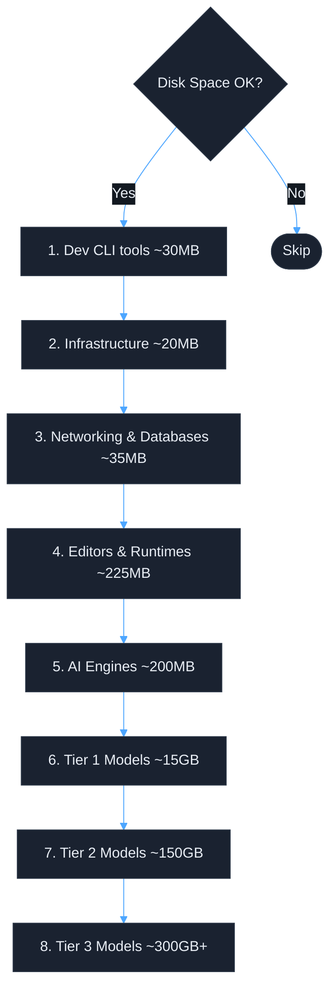

# Val Ark

**Created by Matthew Valancy**

Your favorite tools and AI models as an online-optional server.
Local-first, peer-to-peer, offline-capable.

## Screenshots

Screenshots are generated automatically with Playwright and asciinema:

```bash
./start.sh screenshots          # Capture all (web + terminal)
./start.sh screenshots web      # Web UI only (Playwright)
./start.sh screenshots terminal  # Terminal recordings (asciinema → SVG)
```

Generated files are saved to `docs/screenshots/`.

## Architecture

```mermaid
%%{init: {'theme': 'base', 'themeVariables': {
  'primaryColor': '#1a2230',
  'primaryBorderColor': '#2a3545',
  'primaryTextColor': '#e8edf4',
  'lineColor': '#4da6ff',
  'secondaryColor': '#131921',
  'tertiaryColor': '#0a0e14'
}}}%%
graph TB
    subgraph Entry["Entry Points"]
        style Entry fill:#1a2230,stroke:#4ade80
        START["start.sh<br/>Interactive Menu + CLI"]
        CRON["Cron Job<br/>Weekly Auto-Update"]
    end

    subgraph Scripts["Core Scripts"]
        style Scripts fill:#1a2230,stroke:#4da6ff
        UPDATE["update.sh<br/>Tools & Assets"]
        DOWNLOAD_T["download-tools.sh<br/>AI Engines"]
        DOWNLOAD_M["download-models.sh<br/>AI Models"]
    end

    subgraph Storage["Local Storage"]
        style Storage fill:#1a2230,stroke:#a78bfa
        TOOLS["tools/ — Binaries"]
        SOURCES["sources/ — Build from Source"]
        MODELS["models/ — AI Models"]
    end

    START --> UPDATE
    START --> DOWNLOAD_T
    START --> DOWNLOAD_M
    CRON --> UPDATE
    UPDATE --> TOOLS
    UPDATE --> SOURCES
    DOWNLOAD_M --> MODELS
```



## Download Priority



## What's Included

### AI Engines
llama.cpp, whisper.cpp, stable-diffusion.cpp, BitNet.cpp, Ollama, ONNX Runtime, Vosk, Piper TTS

### Tools & Infrastructure
Syncthing, btop, tmux, FFmpeg, InfluxDB, Tailscale, Mosquitto, MQTT Explorer,
SQLite, Redis, PostgreSQL, Helix, VSCodium, Miniforge, python-build-standalone

### Dev CLI Bundle
ripgrep, fd, bat, jq, fzf, lazygit

### AI Models (~500GB, downloaded by priority)
- **Tier 1 (Edge/Mobile):** Small fast models for phones, tablets, IoT (~15GB)
- **Tier 2 (Workstation):** Balanced quality/speed models (~150GB)
- **Tier 3 (Full):** Largest, highest quality models (~300GB+)

## Platforms

```mermaid
%%{init: {'theme': 'base', 'themeVariables': {
  'primaryColor': '#1a2230',
  'primaryBorderColor': '#2a3545',
  'primaryTextColor': '#e8edf4',
  'lineColor': '#4da6ff',
  'secondaryColor': '#131921',
  'tertiaryColor': '#0a0e14'
}}}%%
graph LR
    subgraph Platforms
        style Platforms fill:#1a2230,stroke:#4ade80
        J["Jetson arm64"]
        L["Linux x86_64"]
        M["macOS arm64"]
        W["Windows x64"]
    end
    subgraph Methods
        style Methods fill:#1a2230,stroke:#4da6ff
        P["Prebuilt"]
        S["Source"]
        I["Installer"]
    end
    J --> P & S & I
    L --> P & S & I
    M --> P & S & I
    W --> P & I
```



| Platform | Arch | Notes |
|----------|------|-------|
| NVIDIA Jetson | arm64 | Orin/Xavier, CUDA builds |
| macOS | arm64 | Apple Silicon, Metal acceleration |
| Linux | x86_64 | Ubuntu/Debian, optional CUDA |
| Windows | x64 | Prebuilt binaries |

## Quick Start

```bash
./start.sh                        # Interactive menu
./start.sh setup                  # Install dependencies
./start.sh download tools         # Get tools (smallest first)
./start.sh download models tier1  # Edge/mobile models
./start.sh status                 # See what's installed
./start.sh cron install           # Weekly auto-update (Sundays 3 AM)
```

## Offline & P2P

```mermaid
%%{init: {'theme': 'base', 'themeVariables': {
  'primaryColor': '#1a2230',
  'primaryBorderColor': '#2a3545',
  'primaryTextColor': '#e8edf4',
  'lineColor': '#4da6ff',
  'secondaryColor': '#131921',
  'tertiaryColor': '#0a0e14'
}}}%%
graph TB
    subgraph Internet["Internet (one-time)"]
        style Internet fill:#1a2230,stroke:#fb923c
        GH["GitHub"] & HF["HuggingFace"]
    end
    subgraph Server["Val Ark Server"]
        style Server fill:#1a2230,stroke:#4ade80
        SYNC["Syncthing"]
        STORE["Local Storage"]
    end
    subgraph Peers["LAN Peers"]
        style Peers fill:#1a2230,stroke:#a78bfa
        P1["Peer 1"] & P2["Peer 2"] & P3["Peer 3"]
    end
    Internet -->|"download once"| Server
    SYNC <-->|"P2P sync"| P1 & P2 & P3
```



Download once from the internet, then share across your LAN using Syncthing P2P. All tools and models work fully offline after initial download.

## Project Structure

```
val-ark/
├── start.sh                  # Entry point: interactive menu + CLI
├── scripts/
│   ├── update.sh             # Update tools, apps, assets, sources
│   ├── download-tools.sh     # Download AI inference engines
│   ├── download-models.sh    # Download AI models by tier
│   ├── setup.sh              # Install dependencies
│   ├── status.sh             # Show installed inventory
│   ├── monitor.sh            # Watch active downloads
│   ├── screenshots.sh        # Capture screenshots & recordings
│   ├── release.sh            # Create git release tags
│   └── ...
├── web-ui/                   # Web interface + assets
├── tests/
│   ├── run-all.sh            # Test runner
│   ├── screenshots/          # Playwright screenshot tests
│   └── test-*.sh             # Validation scripts
├── docs/
│   ├── ARCHITECTURE.md       # Mermaid diagrams
│   ├── TOOLS.md              # Complete tools catalog
│   ├── PLATFORMS.md          # Platform-specific notes
│   ├── OFFLINE.md            # Offline and P2P guide
│   └── MODEL_INVENTORY.md   # Model details
├── tools/                    # Downloaded binaries (gitignored)
├── sources/                  # Cloned repos (gitignored)
└── assets/ollama/            # Ollama installers (gitignored)
```

## Documentation

- [docs/ARCHITECTURE.md](docs/ARCHITECTURE.md) - System diagrams
- [docs/TOOLS.md](docs/TOOLS.md) - Complete tools catalog
- [docs/PLATFORMS.md](docs/PLATFORMS.md) - Platform-specific notes
- [docs/OFFLINE.md](docs/OFFLINE.md) - Offline and P2P guide
- [docs/MODEL_INVENTORY.md](docs/MODEL_INVENTORY.md) - Model details

## Testing

```bash
./start.sh test               # Run via menu
./tests/run-all.sh            # Run directly
./start.sh screenshots        # Capture web + terminal screenshots
./start.sh screenshots web    # Web UI only
./start.sh screenshots terminal  # Terminal recordings only
```

## Releases

Releases are created by pushing version tags:

```bash
./scripts/release.sh 1.0.0          # Create annotated tag
./scripts/release.sh 1.2.0 --push   # Create and push (triggers GitHub release)
```

The GitHub Actions workflow generates a changelog from commits and creates a release automatically.

## License

GPL-3.0 - See [LICENSE](LICENSE)
