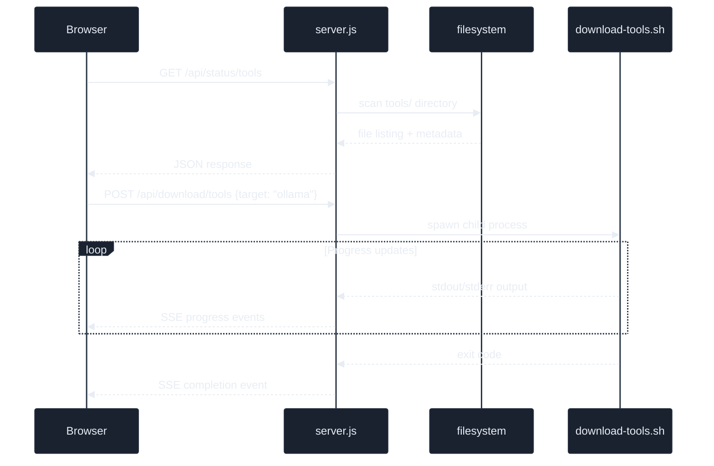
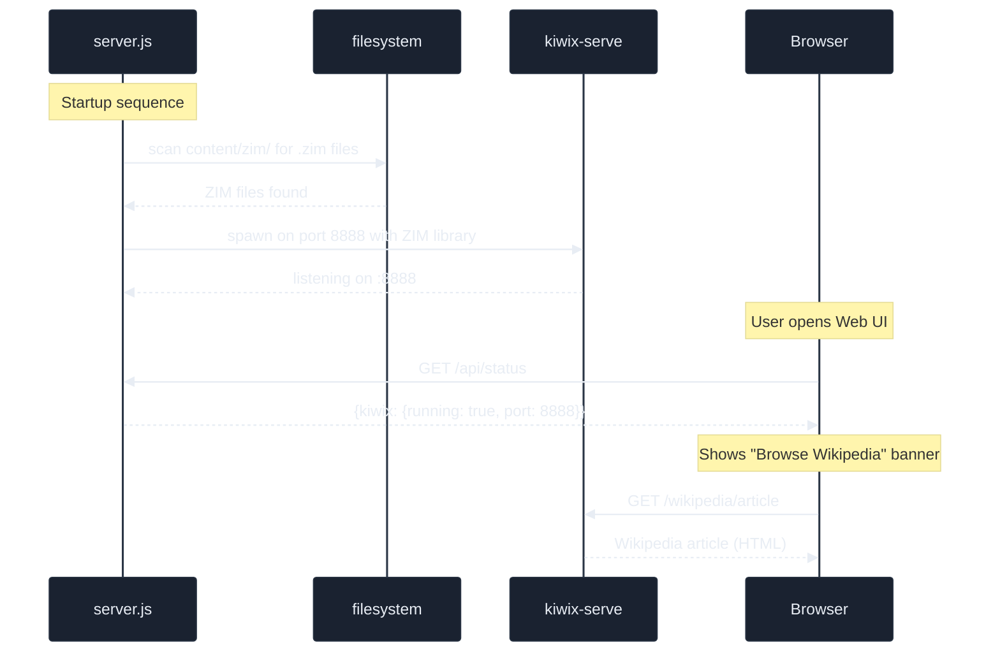

# Val Ark - Architecture

[Back to Docs](README.md) | [Back to Project Root](../README.md)

## Architecture Overview

```mermaid
%%{init: {'theme': 'base', 'themeVariables': {
  'primaryColor': '#1a2230',
  'primaryBorderColor': '#2a3545',
  'primaryTextColor': '#e8edf4',
  'lineColor': '#4da6ff',
  'secondaryColor': '#131921',
  'tertiaryColor': '#0a0e14'
}}}%%
graph TB
    subgraph Entry["Entry Points"]
        style Entry fill:#1a2230,stroke:#4ade80
        START["start.sh<br/>Interactive Menu + CLI"]
        CRON["Cron Job<br/>Weekly Auto-Update"]
    end

    subgraph WebServer["Web Server"]
        style WebServer fill:#1a2230,stroke:#60a5fa
        SERVER["server.js<br/>Express API + Static UI<br/>Port 3000"]
        KIWIX["kiwix-serve<br/>Offline Wikipedia<br/>Port 8888"]
    end

    subgraph Scripts["Core Scripts"]
        style Scripts fill:#1a2230,stroke:#4da6ff
        SETUP["setup.sh<br/>Dependencies"]
        UPDATE["update.sh<br/>Tools & Assets"]
        DOWNLOAD_T["download-tools.sh<br/>AI Engines"]
        DOWNLOAD_M["download-models.sh<br/>AI Models (Tiered)"]
        STATUS["status.sh<br/>Inventory"]
        MONITOR["monitor.sh<br/>Progress"]
        SCREENSHOTS["screenshots.sh<br/>Playwright + asciinema"]
    end

    subgraph Storage["Local Storage"]
        style Storage fill:#1a2230,stroke:#a78bfa
        TOOLS["tools/<br/>Prebuilt Binaries"]
        SOURCES["sources/<br/>Build-from-Source"]
        ASSETS["assets/<br/>Ollama Installers"]
        MODELS["~/.ollama/models<br/>AI Model Files"]
        CONTENT["content/zim/<br/>ZIM Files (Wikipedia)"]
    end

    subgraph External["External Sources"]
        style External fill:#1a2230,stroke:#fb923c
        GITHUB["GitHub Releases"]
        HF["HuggingFace Hub"]
        OLLAMA_REG["Ollama Registry"]
        DIRECT["Direct URLs<br/>(SQLite, FFmpeg, EDB)"]
    end

    subgraph Client["Web UI"]
        style Client fill:#1a2230,stroke:#f472b6
        BROWSER["Browser<br/>Dashboard + Controls"]
    end

    BROWSER -->|"API requests"| SERVER
    SERVER -->|"spawns"| DOWNLOAD_T
    SERVER -->|"spawns"| DOWNLOAD_M
    SERVER -->|"auto-launches"| KIWIX
    KIWIX -->|"serves"| CONTENT

    START --> SETUP
    START --> UPDATE
    START --> DOWNLOAD_T
    START --> DOWNLOAD_M
    START --> STATUS
    START --> MONITOR
    START --> SCREENSHOTS
    CRON --> UPDATE

    UPDATE --> TOOLS
    UPDATE --> SOURCES
    UPDATE --> ASSETS
    DOWNLOAD_T --> TOOLS
    DOWNLOAD_M --> MODELS

    TOOLS -.-> GITHUB
    TOOLS -.-> DIRECT
    SOURCES -.-> GITHUB
    ASSETS -.-> GITHUB
    MODELS -.-> HF
    MODELS -.-> OLLAMA_REG
```

## Download Priority Flow

```mermaid
%%{init: {'theme': 'base', 'themeVariables': {
  'primaryColor': '#1a2230',
  'primaryBorderColor': '#2a3545',
  'primaryTextColor': '#e8edf4',
  'lineColor': '#4da6ff',
  'secondaryColor': '#131921',
  'tertiaryColor': '#0a0e14'
}}}%%
flowchart TD
    START([Start Download]) --> DISK{Disk Space Check<br/>Hard min: 50GB}
    DISK -->|Below minimum| ABORT([Skip Download])
    DISK -->|OK| TOOLS

    subgraph TOOLS["Tools (smallest first)"]
        style TOOLS fill:#1a2230,stroke:#4ade80
        T1["Dev CLI Bundle<br/>rg, fd, bat, jq, fzf, lazygit<br/>~30MB"]
        T2["Infrastructure<br/>Syncthing, btop, tmux<br/>~20MB"]
        T3["Networking & IoT<br/>Tailscale, Mosquitto<br/>~25MB"]
        T4["Databases<br/>SQLite, Redis<br/>~10MB"]
        T5["Editors<br/>Helix, VSCodium<br/>~115MB"]
        T6["AI Engines<br/>llama.cpp, whisper.cpp, BitNet.cpp, Piper<br/>~250MB"]
        T1 --> T2 --> T3 --> T4 --> T5 --> T6
    end

    TOOLS --> TIER1

    subgraph TIER1["Tier 1: Edge/Mobile (~15GB)"]
        style TIER1 fill:#1a2230,stroke:#4da6ff
        M1["Small LLMs: Phi, Gemma, Qwen 1-3B"]
        M2["TTS: Piper voices, Kokoro"]
        M3["ASR: Whisper tiny/base, Vosk"]
    end

    TIER1 --> BUDGET1{Budget Check<br/>Buffer: 200GB}
    BUDGET1 -->|OK| TIER2

    subgraph TIER2["Tier 2: Workstation (~150GB)"]
        style TIER2 fill:#1a2230,stroke:#a78bfa
        M4["Medium LLMs: Llama 8B, Mistral 7B"]
        M5["Vision: LLaVA, Moondream"]
        M6["Code: CodeLlama, DeepSeek Coder"]
    end

    TIER2 --> BUDGET2{Budget Check}
    BUDGET2 -->|OK| TIER3

    subgraph TIER3["Tier 3: Full (~300GB+)"]
        style TIER3 fill:#1a2230,stroke:#fb923c
        M7["Large LLMs: Llama 70B, Mixtral"]
        M8["Specialized: Medical, Legal, Math"]
        M9["Image Gen: SDXL, Flux"]
    end

    TIER3 --> DONE([Complete])
    BUDGET1 -->|Exceeded| DONE
    BUDGET2 -->|Exceeded| DONE
```

## Offline & P2P Topology

```mermaid
%%{init: {'theme': 'base', 'themeVariables': {
  'primaryColor': '#1a2230',
  'primaryBorderColor': '#2a3545',
  'primaryTextColor': '#e8edf4',
  'lineColor': '#4da6ff',
  'secondaryColor': '#131921',
  'tertiaryColor': '#0a0e14'
}}}%%
graph TB
    subgraph Internet["Internet (one-time download)"]
        style Internet fill:#1a2230,stroke:#fb923c
        GITHUB["GitHub Releases"]
        HF["HuggingFace"]
        OLLAMA["Ollama Registry"]
    end

    subgraph Server["Val Ark Server"]
        style Server fill:#1a2230,stroke:#4ade80
        SYNC["Syncthing<br/>P2P Daemon"]
        STORE["Local Storage<br/>tools/ + models/"]
        WEBUI["Web UI<br/>Browse & Manage"]
    end

    subgraph Peers["LAN / P2P Peers"]
        style Peers fill:#1a2230,stroke:#a78bfa
        PEER1["Peer 1<br/>Jetson Orin"]
        PEER2["Peer 2<br/>Linux Desktop"]
        PEER3["Peer 3<br/>MacBook"]
    end

    Internet -->|"Initial sync<br/>(online)"| Server
    SYNC <-->|"Syncthing P2P<br/>(offline OK)"| PEER1
    SYNC <-->|"Syncthing P2P<br/>(offline OK)"| PEER2
    SYNC <-->|"Syncthing P2P<br/>(offline OK)"| PEER3
    PEER1 <-.->|"Direct LAN"| PEER2
    PEER2 <-.->|"Direct LAN"| PEER3
```

## Server Architecture

The web UI is served by `server.js`, which provides a REST API for managing downloads
and querying system status. Download operations are handled by spawning the relevant
shell scripts as child processes, with progress streamed back to the browser via
Server-Sent Events (SSE).

## Content Serving

On startup, `server.js` scans the `content/zim/` directory for ZIM files (offline
Wikipedia archives). If ZIM files are found, it automatically spawns `kiwix-serve`
on port 8888 to serve them. The web UI detects that kiwix-serve is running and
displays a "Browse Wikipedia" banner linking users to the offline encyclopedia.

