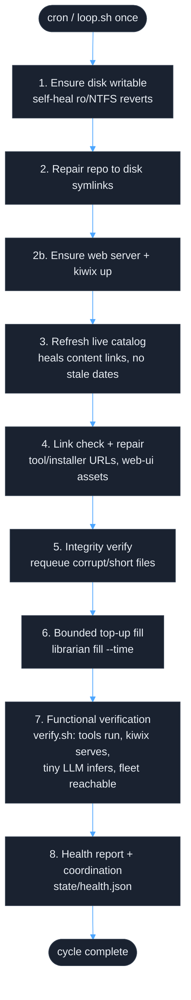
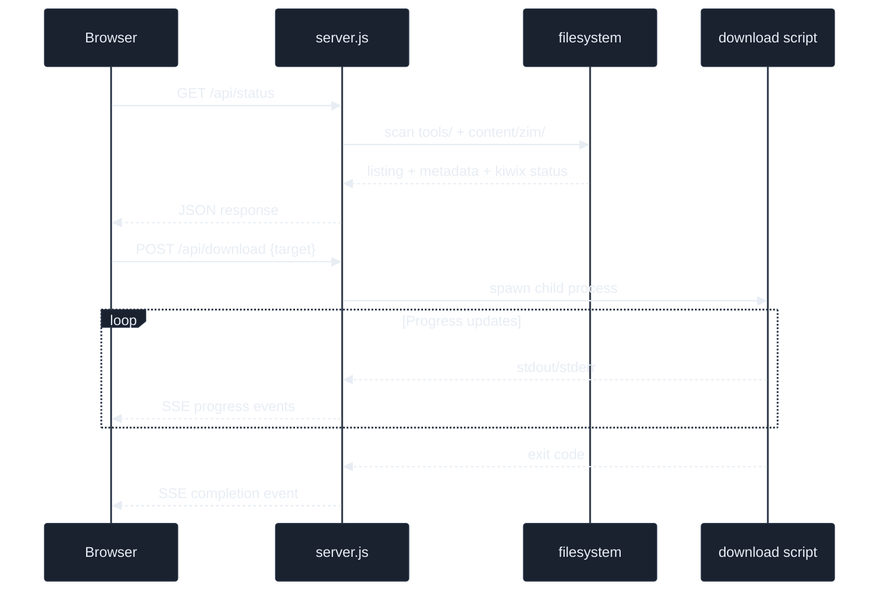
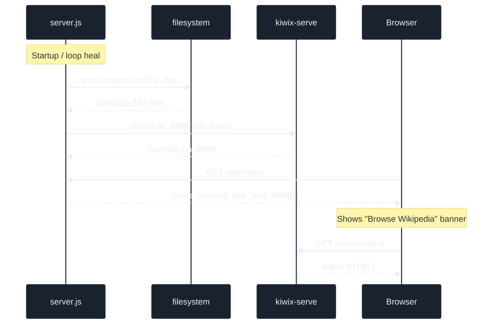

# Val Ark - Architecture

[Back to Docs](README.md) | [Back to Project Root](../README.md)

Val Ark is an online-optional, local-first mirror of dev/AI tools, AI models, and
offline content (ZIM via Kiwix), with a web UI. It fills a disk of *any* size from
live catalogs and keeps everything intact and verified via a 24/7 self-healing loop.
For the curation/fill engine see [LIBRARIAN.md](LIBRARIAN.md); for the disk layout
and `.env` config see the same doc's "Where data lives" section.

## Architecture Overview

```mermaid
%%{init: {'theme': 'base', 'themeVariables': {
  'primaryColor': '#1a2230',
  'primaryBorderColor': '#2a3545',
  'primaryTextColor': '#e8edf4',
  'lineColor': '#4da6ff',
  'secondaryColor': '#131921',
  'tertiaryColor': '#0a0e14'
}}}%%
graph TB
    subgraph Entry["Entry Points"]
        style Entry fill:#1a2230,stroke:#4ade80
        START["start.sh<br/>Menu + CLI"]
        LOOP["loop.sh<br/>24/7 self-heal cron"]
    end

    subgraph WebServer["Web Server"]
        style WebServer fill:#1a2230,stroke:#60a5fa
        SERVER["server.js<br/>zero-dep Node<br/>UI + JSON API + SSE<br/>VALARK_WEB_PORT (3000)"]
        KIWIX["kiwix-serve<br/>auto-launched<br/>Port 8888"]
    end

    subgraph Engine["Librarian Engine"]
        style Engine fill:#1a2230,stroke:#4da6ff
        LIB["librarian.sh<br/>status|plan|fill|verify<br/>evict|maintain|refresh"]
        CAT["lib/catalog.sh<br/>lib/kiwix_catalog.py<br/>live OPDS catalog"]
        PLAN["lib/planner.py<br/>priority model"]
        VERIFY["verify.sh<br/>does it run?"]
    end

    subgraph EnvLayer["Env / Layout"]
        style EnvLayer fill:#1a2230,stroke:#fbbf24
        ENV["lib/valark-env.sh<br/>resolve DATA_ROOT (.env)<br/>symlink repo dirs<br/>disk math + reserve"]
    end

    subgraph Storage["Data Root (any disk)"]
        style Storage fill:#1a2230,stroke:#a78bfa
        MODELS["models/<br/>GGUF + repos"]
        TOOLS["val-ark/tools/<br/>prebuilt binaries"]
        CONTENT["val-ark/content/zim/<br/>ZIM (Kiwix)"]
        INSTALLERS["val-ark/installers/<br/>OS/router images"]
        STATE["val-ark/state/<br/>manifest + health"]
    end

    subgraph External["Live Catalogs / Sources"]
        style External fill:#1a2230,stroke:#fb923c
        KIWIXCDN["Kiwix OPDS + CDN"]
        HF["HuggingFace Hub"]
        GITHUB["GitHub Releases"]
        DIRECT["Direct URLs"]
    end

    START --> LIB
    START --> SERVER
    LOOP --> LIB
    LOOP --> VERIFY
    LOOP --> SERVER

    SERVER --> ENV
    LIB --> ENV
    LIB --> CAT
    LIB --> PLAN
    CAT -.-> KIWIXCDN
    ENV --> Storage

    SERVER -->|API + SSE| TOOLS
    SERVER -->|auto-launch| KIWIX
    KIWIX -->|serves| CONTENT

    LIB -->|aria2 / curl| MODELS
    LIB --> CONTENT
    LIB --> INSTALLERS
    LIB --> STATE
    MODELS -.-> HF
    TOOLS -.-> GITHUB
    INSTALLERS -.-> DIRECT
    VERIFY -.-> STATE
```

## Fill Priority Flow

The Librarian fills the data root in curation order from **live** catalogs. There is
no fixed tier ceiling — it scales to whatever disk is mounted, stopping at the
reserve (`max(VALARK_RESERVE_PCT%, VALARK_RESERVE_MIN_GB)`). See
[LIBRARIAN.md](LIBRARIAN.md) for the full model.

```mermaid
%%{init: {'theme': 'base', 'themeVariables': {
  'primaryColor': '#1a2230',
  'primaryBorderColor': '#2a3545',
  'primaryTextColor': '#e8edf4',
  'lineColor': '#4da6ff',
  'secondaryColor': '#131921',
  'tertiaryColor': '#0a0e14'
}}}%%
flowchart TD
    START([fill]) --> REFRESH["Refresh live catalogs<br/>Kiwix OPDS + models + installers"]
    REFRESH --> PLANNER["planner.py builds ordered plan<br/>budget = fillable bytes"]
    PLANNER --> P1

    subgraph P1["1. Diversity first"]
        style P1 fill:#1a2230,stroke:#4ade80
        D1["Smallest item from every<br/>category before deepening any"]
    end

    P1 --> P2
    subgraph P2["2. Small valuable"]
        style P2 fill:#1a2230,stroke:#4da6ff
        D2["Items by value/byte,<br/>capped per category"]
    end

    P2 --> P3
    subgraph P3["3. Fill remaining"]
        style P3 fill:#1a2230,stroke:#a78bfa
        D3["Big flagships by value<br/>full Wikipedia, large quants, ISOs"]
    end

    P3 --> P4
    subgraph P4["4. Evict for better"]
        style P4 fill:#1a2230,stroke:#fb923c
        D4["Disk full + better small item<br/>drop lowest value/byte<br/>never a sole category rep"]
    end

    P1 --> DL{Headroom<br/>above reserve?}
    P2 --> DL
    P3 --> DL
    DL -->|No| DONE([stop at reserve])
    DL -->|Yes| GET["download_one<br/>aria2 -x8 (curl fallback)<br/>resume, retry, size-verify,<br/>atomic rename, flock"]
    GET --> DONE
```

## Self-Healing Loop

`loop.sh once` runs one maintenance cycle; `loop.sh install [minutes]` registers a
flock-guarded cron so it survives reboots. Each cycle is safe to run repeatedly and
concurrently with a standalone fill (the fill flock prevents double-downloading) and
never aborts on a single failure.

## Mesh Topology

The data root is **NFS-exportable**: fleet nodes mount the single shared mirror and
run GPU inference on served models over the network. Syncthing additionally offers
opportunistic P2P replication to peers. `verify.sh fleet` SSHes to each host in
`VALARK_FLEET` (set in `.env`), confirms it mounts the shared disk, and runs a real
inference check. Nothing host-specific is committed — see `.env.example`.

```mermaid
%%{init: {'theme': 'base', 'themeVariables': {
  'primaryColor': '#1a2230',
  'primaryBorderColor': '#2a3545',
  'primaryTextColor': '#e8edf4',
  'lineColor': '#4da6ff',
  'secondaryColor': '#131921',
  'tertiaryColor': '#0a0e14'
}}}%%
graph TB
    subgraph Internet["Internet (online-optional)"]
        style Internet fill:#1a2230,stroke:#fb923c
        CAT["Live catalogs<br/>Kiwix / HuggingFace / GitHub"]
    end

    subgraph Server["Val Ark Server"]
        style Server fill:#1a2230,stroke:#4ade80
        LIB["librarian.sh + loop.sh"]
        STORE["Data Root<br/>models + tools + content<br/>(NFS export)"]
        SYNC["Syncthing<br/>P2P daemon"]
        WEBUI["server.js Web UI"]
    end

    subgraph Fleet["Mesh Fleet"]
        style Fleet fill:#1a2230,stroke:#a78bfa
        N1["Jetson Orin / Thor"]
        N2["GB10 Grace-Blackwell"]
        N3["x86_64 / Apple Silicon"]
        RT["OpenWRT router<br/>content/sync subset"]
    end

    CAT -->|"initial fill (online)"| LIB
    LIB --> STORE
    STORE -->|"NFS mount<br/>(offline OK)"| N1
    STORE -->|"NFS mount"| N2
    STORE -->|"NFS mount"| N3
    N1 -->|"GPU inference<br/>on served models"| STORE
    N2 -->|"GPU inference"| STORE
    SYNC <-.->|"Syncthing P2P"| RT
```

## Web Server

`server.js` is a **zero-dependency Node** server. It serves the static web UI plus a
JSON API and Server-Sent Events (SSE) for live progress. Download actions spawn the
relevant shell scripts as child processes and stream their output back to the browser.
The listen port comes from `VALARK_WEB_PORT` (`.env`, default 3000); `/api/health`
returns `{status:"ok", version}` so the loop and `verify.sh` can confirm it is really
the Val Ark server and not another app squatting the port.

## Content Serving

On startup (and again whenever the loop heals it), `server.js` scans `content/zim/`
for complete `.zim` files. If any exist it auto-launches `kiwix-serve` on port 8888
with the whole ZIM library. The web UI polls `/api/status`, sees kiwix is running,
and shows a "Browse Wikipedia" banner linking to the offline encyclopedia. The ZIM
catalog is fetched **live** from the Kiwix OPDS feed, so download dates are never
stale.

## Platforms

Tools ship as prebuilt binaries per platform; the web UI lets you pick one and shows
its availability. GPU-accelerated `llama.cpp` / `whisper.cpp` / `sd.cpp` on aarch64
require a CUDA source build (no upstream binary) — see [PLATFORMS.md](PLATFORMS.md).

| web-ui platform | Arch / tools dir | Notes |
|-----------------|------------------|-------|
| `jetson` | `linux-arm64` | Jetson Orin |
| `thor` | `linux-arm64` | Jetson Thor (inherits arm64) |
| `gb10` | `linux-arm64` | GB10 Grace-Blackwell (SBSA) |
| `ubuntu` | `linux-x86_64` | Ubuntu / Debian / Fedora |
| `mac` | `macos-arm64` | Apple Silicon |
| `windows` | `windows-x64` | Windows 10/11 |
| `openwrt` | `linux-arm64` | Routers; content/sync/infra subset only |

## Project Structure

| Path | Purpose |
|------|---------|
| `start.sh` | Interactive menu + CLI (setup, download, update, serve, cron) |
| `scripts/librarian.sh` | Disk-fill + curation engine (`status\|plan\|fill\|verify\|evict\|maintain\|refresh`) |
| `scripts/loop.sh` | 24/7 self-healing + verification cycle (`once\|run\|install\|uninstall`) |
| `scripts/verify.sh` | Functional checks: tools run, kiwix serves, LLM infers, fleet reachable |
| `scripts/lib/valark-env.sh` | Resolve `DATA_ROOT` from `.env`, symlink repo dirs, disk math |
| `scripts/lib/catalog.sh` | Build candidate catalog (models/installers + live ZIM) |
| `scripts/lib/kiwix_catalog.py` | Fetch + parse the live Kiwix OPDS catalog |
| `scripts/lib/planner.py` | Apply the priority model to produce the ordered plan |
| `scripts/download-tools.sh` | Mirror prebuilt tool binaries (per `scripts/tools/*.sh`) |
| `scripts/download-models.sh` | Tiered model downloads |
| `scripts/server.js` | Zero-dep Node web UI + JSON API + SSE; auto-launches kiwix |
| `scripts/setup.sh` / `status.sh` / `monitor.sh` | Deps, inventory, progress |
| `data/installers.tsv`, `data/models-extra.tsv` | Catalog source rows |
| `web-ui/` | Static dashboard (TOOLS array, logos, screenshots) |
| `tests/` | Bash validators (`test-*.sh`) + Playwright suite under `tests/screenshots/` |
| `.env.example` | Documented machine config (`VAL_ARK_DATA`, `VALARK_WEB_PORT`, `VALARK_FLEET`, reserve) |

Val Ark currently mirrors **43** tools (`scripts/tools/*.sh`). The scripts never
install anything on the server itself — they mirror binaries and write install hints
for the user. See [TOOLS.md](TOOLS.md) for the catalog and [LIBRARIAN.md](LIBRARIAN.md)
for the fill engine.
