# Val Ark - Community & Comms Layer

↑ [Docs](README.md) · [Repo root](../README.md)

Val Ark is not only a knowledge bank — it is a place to *talk*. The community layer
adds offline communication on top of the existing mirror so a single Val Ark box is
both the library (ZIMs via Kiwix, TED talks, models, tools) **and** the town square:
message a friend, ask a question on the boards, drop a file for the person next to you,
or send mail to a neighbor — all over the LAN/mesh with the internet unplugged. Like
everything else in Val Ark these services are mirrored for offline install, run
LAN-bound on the Val Ark host, and live framed inside the same web shell as the rest
of the dashboard.

## Contents

- [The Four Services](#the-four-services)
- [Architecture](#architecture)
- [Services](#services)
- [Security Model](#security-model)
- [Supervision & Configuration](#supervision--configuration)

## The Four Services

| ID | Name | What it is | Software (why) | Path | Internal port |
|----|------|-----------|----------------|------|---------------|
| `chat` | IRC Chat | Real-time channels + DMs | ngIRCd + The Lounge (tiny C daemon, sqlite-backed web client) | `/app/chat/` | 9000 |
| `mail` | Mail | Local community email | maddy + alps (single static Go SMTP/IMAP binary) | `/app/mail/` | 1323 |
| `forum` | Message Boards | Async threads, Q&A, announcements | NodeBB on the mirrored Redis (no Mongo) | `/app/forum/` | 4567 |
| `paste` | Files & Pastebin | Snippets, file upload, URL shortener | MicroBin (one static Rust binary) | `/app/paste/` | 8085 |

## Architecture

Every community service follows the same three-stage contract — identical to how Kiwix
already lives inside Val Ark:

1. **Mirrored** for offline install. `scripts/tools/<id>.sh` caches the upstream
   binary (or source, when no portable binary exists) into the tools tree per platform,
   exactly like the 45 existing tool mirrors. Nothing is installed on the server itself.
2. **Run LAN-bound** on the Val Ark host. `scripts/services/<id>.sh start|stop|restart|status`
   builds (first run, for source-only components) and launches the service, binding its
   web UI to `127.0.0.1` so only the reverse proxy can reach it. Any user-facing protocol
   ports honour `VALARK_BIND` (mail's IMAP/submission default `0.0.0.0` for the LAN;
   plaintext native IRC defaults `127.0.0.1`).
3. **Framed** in the web shell at `/app/<id>/`. `server.js` reverse-proxies the service
   same-origin, so the fixed Val Ark top-nav stays on screen as a permanent
   "back to Val Ark" header — the same pattern `/kiwix/` uses today (pipe bytes through,
   no HTML rewriting; services run under their proxy base path so links resolve).

```mermaid
%%{init: {'theme': 'base', 'themeVariables': {
  'primaryColor': '#1a2230',
  'primaryBorderColor': '#2a3545',
  'primaryTextColor': '#e8edf4',
  'lineColor': '#4da6ff',
  'secondaryColor': '#131921',
  'tertiaryColor': '#0a0e14'
}}}%%
graph TB
    subgraph Browser["LAN Browser (one origin :3000)"]
        style Browser fill:#1a2230,stroke:#4ade80
        SHELL["Val Ark shell<br/>persistent top-nav<br/>'back to Val Ark'"]
    end

    subgraph WebServer["server.js (zero-dep Node, VALARK_WEB_PORT)"]
        style WebServer fill:#1a2230,stroke:#60a5fa
        PROXY["generic /app/&lt;id&gt;/ reverse proxy<br/>+ /kiwix/ (existing)"]
        SUP["service liveness probes<br/>(loop.sh (re)starts each cycle)"]
    end

    subgraph Services["Community Services (LAN-bound, VALARK_BIND)"]
        style Services fill:#1a2230,stroke:#a78bfa
        CHAT["chat<br/>ngIRCd + The Lounge<br/>web 127.0.0.1:9000"]
        MAIL["mail<br/>maddy + alps<br/>web 127.0.0.1:1323"]
        FORUM["forum<br/>NodeBB on Redis<br/>127.0.0.1:4567"]
        PASTE["paste<br/>MicroBin<br/>127.0.0.1:8085"]
    end

    subgraph Storage["Data Root (any disk)"]
        style Storage fill:#1a2230,stroke:#fbbf24
        STATE["val-ark/state/services/&lt;id&gt;<br/>config + creds + history"]
        TOOLS["val-ark/tools/&lt;platform&gt;/&lt;id&gt;<br/>mirrored binaries/source"]
    end

    SHELL --> PROXY
    PROXY -->|/app/chat/| CHAT
    PROXY -->|/app/mail/| MAIL
    PROXY -->|/app/forum/| FORUM
    PROXY -->|/app/paste/| PASTE
    SUP -.->|start/health| Services
    Services --> STATE
    TOOLS -.->|installed from| Services
```

## Services

### IRC Chat — `/app/chat/` (port 9000)

Classic real-time IRC for the LAN: channels and direct messages over **ngIRCd**, a tiny
portable C daemon, with **The Lounge** as a self-hosted web client that keeps persistent,
searchable, sqlite-backed history. Chosen because ngIRCd is a single small C server (no
database service) and The Lounge is the standard always-on web IRC client; both are
deliberately federation-free, so the whole conversation stays on the LAN.

- **Runtime deps:** a C toolchain (make/gcc) builds ngIRCd; The Lounge (pinned **v4.4.3**,
  needs Node ≥18 — newer releases require Node 22) builds via npm with `--legacy-peer-deps`.
  Val Ark mirrors a portable **Node 22** runtime (`scripts/tools/node.sh`, under
  `tools/<platform>/node`) and the service prefers it, so chat runs with its own Node
  regardless of the host version. `scripts/tools/chat.sh` mirrors source; `chat.sh start`
  builds in-place on first run (one online build), fully offline after. No Redis — The
  Lounge uses sqlite.
- **Bind:** ngIRCd → `VALARK_BIND:6667`, defaulting to `127.0.0.1` (The Lounge is the
  supported entry point; set `VALARK_BIND=0.0.0.0` to let native LAN IRC clients connect —
  the script warns, since native IRC is plaintext); The Lounge web → `127.0.0.1:9000`,
  reached only via the proxy.
- **First run:** auto-creates a private-mode admin account and saves a generated 16-char
  password to a chmod-600 `admin-credentials.txt` in the chat state dir (not echoed to
  capturable logs); pin via `VALARK_CHAT_ADMIN_USER` / `VALARK_CHAT_ADMIN_PASS`.

### Mail — `/app/mail/` (port 1323)

Self-contained community email. **maddy** provides SMTP submission + IMAP + local delivery
in one static Go binary; **alps** is a lightweight webmail UI framed at `/app/mail/`.
Chosen because maddy is a true single static binary with a built-in user store (no
PHP/Node/DB runtime), and alps is a thin IMAP/SMTP web front-end.

- **Runtime deps:** none for the server (static Go binary, prebuilt for Linux arm64/x86_64).
  alps is source-only (SourceHut) and built with Go; until built, IMAP/SMTP clients
  (Thunderbird, K-9, etc.) still work and the script logs that webmail is disabled.
- **Bind:** maddy IMAP + submission → `VALARK_BIND` (default `0.0.0.0`). The privileged
  defaults 143/587 auto-shift to **1143/1587** when not run as root (pin via
  `VALARK_MAIL_IMAP_PORT` / `_SUBMISSION_PORT`); local MX :25 only when root + `127.0.0.1`;
  alps web → always `127.0.0.1:1323`.
- **First run REQUIRES** creating an admin login + mailbox:
  `scripts/services/mail.sh creds create postmaster@valark.lan` then
  `scripts/services/mail.sh acct create postmaster@valark.lan`.

### Message Boards — `/app/forum/` (port 4567)

Async forums: categories, threads, announcements, and Q&A with accepted answers, built on
**NodeBB**. Chosen because it is a mature forum platform that runs entirely on the **Redis
Val Ark already mirrors** — no MongoDB, no second datastore.

- **Runtime deps:** NodeBB v4 requires **Node ≥22** (its `undici` dep crashes on older
  Node). Val Ark mirrors a portable Node 22 (`scripts/tools/node.sh`) and `forum.sh` runs
  NodeBB with it — no system Node 22 needed. Redis comes from the mirrored
  `tools/<platform>/redis` (the service auto-starts a localhost-only Redis on 6379 if none
  responds). `forum.sh start` is self-contained: it bootstraps NodeBB's `package.json`,
  runs `npm install --omit=dev --legacy-peer-deps`, and performs an unattended setup — no
  manual steps.
- **Bind:** `VALARK_BIND` (default `127.0.0.1:4567`); internal Redis binds `127.0.0.1` only.
- **First run:** creates the admin account interactively, or unattended via
  `VALARK_FORUM_ADMIN_USERNAME` / `_PASSWORD` / `_EMAIL`. ActivityPub/federation, social
  login, and outbound webhooks are left disabled.

### Files & Pastebin — `/app/paste/` (port 8085)

Quick offline sharing: pastebin for text/code, file uploads (with optional encryption),
a URL shortener, and burn-after-reading/expiring pastas — all from **MicroBin**, one
self-contained static Rust binary (server + web client). Chosen for being a single
zero-dependency binary prebuilt for every platform, with telemetry and update-checking
that can be forced off.

- **Runtime deps:** none. Mirror with `scripts/tools/paste.sh`; the service auto-picks the
  host binary from `tools/<platform>/paste/microbin`. Stores everything in a local SQLite DB.
- **Bind:** `127.0.0.1:8085` by default (set `VALARK_BIND=0.0.0.0` to expose directly).
  `MICROBIN_PUBLIC_PATH=/app/paste/` so links resolve behind the proxy.
- **First run:** auto-generates HTTP Basic creds (user `valark`) plus a separate admin
  password (user `admin`), saved to `<dataDir>/credentials.txt` (chmod 600); override via
  `PASTE_AUTH_USER` / `PASTE_AUTH_PASSWORD` / `PASTE_ADMIN_PASSWORD`. Pastas default private.

## Security Model

> A full multi-agent security audit of Val Ark (repo secrets, the reverse proxy, service
> scripts, runtime posture, web-UI XSS, and network/filesystem exposure) lives in
> [`SECURITY-AUDIT.md`](SECURITY-AUDIT.md). It confirmed the app/proxy layer is sound and the
> repo is secret-free; the residual risks are **host-level** (NFS export scope + FUSE-disk
> permissions) and need operator action with `sudo` — start there.

This layer is built for a **trusted offline LAN/mesh, not the internet**. The posture is
explicit and uniform across all four services:

- **LAN/mesh-only binding.** Web UIs bind `127.0.0.1` and are reachable only through the
  Val Ark reverse proxy (one origin, over HTTP or the local-CA HTTPS listener). Protocol
  ports that must face users honour `VALARK_BIND`: mail's IMAP 143 + submission 587 default
  `0.0.0.0` for the LAN, while native IRC 6667 defaults `127.0.0.1` (it is plaintext — web
  chat rides the proxy). Set `VALARK_BIND=127.0.0.1` in `.env` for host-only. None of this
  is intended to be port-forwarded to the public internet.
- **No internet relay or federation.** chat has zero `[Server]` blocks (no server-to-server
  linking, no link prefetch). mail's config has no `target_remote`/relay, so any non-local
  recipient is rejected (`501 5.1.8 only local delivery is allowed`) — mail physically
  cannot leave the box. forum keeps ActivityPub/social-login/webhooks off. paste forces
  `MICROBIN_DISABLE_TELEMETRY` and `MICROBIN_DISABLE_UPDATE_CHECKING`. **Zero outbound calls
  at runtime.**
- **Auth required, always.** chat runs in private mode (login per user); mail mandates
  SASL/IMAP auth; forum requires login with a first-run admin; paste gates the whole
  instance behind HTTP Basic plus a separate admin password. First-run credentials are
  generated and saved to chmod-600 files in each service's state dir (or pinned via env) —
  operators should rotate them after first login.
- **Data on the data disk.** All config, credentials, and message history live under the
  Val Ark data tree at `state/services/<id>`, so they ride the same NFS-exportable disk and
  backups as the rest of the mirror.
- **Runs unprivileged.** Services run as the normal Val Ark user. The only privileged path
  is mail's optional MX on port 25, which is emitted only when running as root; submission
  + IMAP cover all community mail otherwise. Mail's LAN listeners offer STARTTLS via the
  Ark's own local CA (`scripts/lib/tls.sh`); with a cert present maddy refuses plaintext
  AUTH unless the client upgrades, falling back to `tls off` only if openssl is unavailable.

## Supervision & Configuration

**Supervision.** The community services are kept alive by the same self-healing loop that
already ensures `server.js` and `kiwix-serve` are up. `loop.sh once` runs
`scripts/services/<id>.sh start` for each *enabled* service every cycle (step 2d, right
after "ensure web server + kiwix up" in step 2b); `start` is idempotent — a no-op when a
service is already up — so a crashed or post-reboot service comes back without manual
intervention. `server.js` probes each service's internal port so the UI only offers
"Launch" when it is actually running. `scripts/services/<id>.sh status` gives each
service's process state, ports, data dir, and a liveness probe.

**Configuration** (all in the git-ignored `.env`):

| Key | Purpose |
|-----|---------|
| `VALARK_BIND` | LAN bind address for user-facing ports (`127.0.0.1` = host-only everywhere; mail defaults `0.0.0.0`, native IRC and the web UIs default `127.0.0.1`). |
| `VALARK_WEB_PORT` | The primary origin/port the shell + all `/app/<id>/` proxies are served on (default 3000; also reachable via `VALARK_WEB_EXTRA_PORTS`, the `VALARK_WEB_PUBLIC_PORT` redirect, and HTTPS on `VALARK_HTTPS_PORT`). |
| `VALARK_SERVICES` | Space-separated enable list, e.g. `"chat mail forum paste"` (empty = none). |
| `VALARK_CHAT_ADMIN_USER` / `VALARK_CHAT_ADMIN_PASS` | Pin the chat admin login. |
| `VALARK_FORUM_ADMIN_USERNAME` / `_PASSWORD` / `_EMAIL` | Unattended forum admin creation. |
| `PASTE_AUTH_USER` / `PASTE_AUTH_PASSWORD` / `PASTE_ADMIN_PASSWORD` | Pin paste credentials. |

Per-service internal ports (`VALARK_KIWIX_PORT`-style) keep their documented defaults
(9000 / 1323 / 4567 / 8085) and rarely need changing since they are localhost-only behind
the proxy.

---

See [ARCHITECTURE.md](ARCHITECTURE.md) for the overall system and the existing `/kiwix/`
proxy pattern, and [OFFLINE.md](OFFLINE.md) for the NFS-shared mesh these services ride on.
