# Val Ark - Offline & P2P Guide

[Back to Docs](README.md) | [Back to Project Root](../README.md)

## Design Philosophy

Val Ark is **online-optional**: pull everything once while online, then run
entirely offline and share between machines over the LAN.

- Download once while online; the **Librarian** fills any-size disk from live catalogs.
- Run inference, content, and the web UI fully offline afterward.
- Sync between machines over LAN — Syncthing P2P, or one NFS-exported shared mirror.
- A 24/7 loop keeps the mirror current, intact, and verified.

## Where data lives (configurable)

All bulk data lives on a single **data root** resolved by `scripts/lib/valark-env.sh`.
Nothing host-specific is committed — your machine's settings go in a git-ignored
`.env` (copy `.env.example`):

```bash
cp .env.example .env
# edit .env:
VAL_ARK_DATA=/mnt/yourdisk    # models reused at $VAL_ARK_DATA/models
```

If unset, the data root is autodetected (largest writable mount, else the repo dir).
Models stay at `$VAL_ARK_DATA/models`; everything else lives under
`$VAL_ARK_DATA/val-ark/{tools,content,sources,assets,installers,state}`. Repo-relative
dirs are symlinked to the disk so legacy scripts work unchanged. See
[LIBRARIAN.md](LIBRARIAN.md) for the full data-root and curation model.

## Offline Workflow

### 1. Initial download (requires internet)

```bash
./start.sh setup
./start.sh download tools             # smallest first, then AI engines
./start.sh download models tier1      # edge/mobile (small, fast)
./start.sh download models tier2      # balanced workstation
./start.sh download models tier3      # large (space permitting)

# Or let the Librarian curate a disk of any size from live catalogs:
scripts/librarian.sh plan             # dry-run the ordered plan
scripts/librarian.sh fill             # download it (aria2 multi-conn, resumable)
```

### 2. Verify downloads

```bash
./start.sh status                     # inventory + disk usage
scripts/librarian.sh verify           # integrity-check managed files (offline)
scripts/verify.sh                     # confirm apps actually RUN (tools/Kiwix/LLM/API)
```

### 3. Go offline

Once downloaded, everything runs locally. The `start.sh` helpers locate the right
prebuilt binary and a suitable model automatically (no internet needed):

```bash
./start.sh chat                       # LLM chat server  (http://localhost:8080)
./start.sh transcribe audio.wav       # speech-to-text   (whisper.cpp)
./start.sh speak "Hello world"        # text-to-speech   (Piper -> speech.wav)
./start.sh serve                      # web UI + API + auto kiwix-serve (port 3000)
```

Prebuilt binaries live at `tools/<platform>/<tool>/...` (e.g.
`tools/linux-arm64/llama-cpp/llama-server`, `tools/linux-arm64/piper/piper`); models
live under `$VAL_ARK_DATA/models/{llm,stt,tts,...}`. On aarch64, GPU-accelerated
llama/whisper/sd require a CUDA source build — see [PLATFORMS.md](PLATFORMS.md).

## 24/7 self-healing

`scripts/loop.sh` keeps an offline mirror healthy without supervision: it ensures the
disk is writable, repairs symlinks, keeps the web server up, refreshes the live
catalog (content links self-heal — no stale dates), checks & repairs links, verifies
integrity, tops up the fill, and runs functional verification. Install it as a
flock-guarded cron job:

```bash
scripts/loop.sh install 30            # one cycle every 30 min (survives reboot)
scripts/loop.sh uninstall
```

Full details: [LIBRARIAN.md](LIBRARIAN.md).

## Sharing between machines

### Option A — NFS shared mirror (mesh)

The data root is NFS-exportable, so fleet nodes mount **one shared mirror** and run
GPU inference on served models over the network. Set `VALARK_FLEET` in `.env` and the
verification loop checks each remote node over SSH (reachable, sees the shared content,
GPU inference works on NFS-served models).

### Option B — Syncthing P2P

1. Syncthing ships in the tools download:
   ```bash
   ./tools/<platform>/syncthing/syncthing    # web UI at http://localhost:8384
   ```
2. Share `$VAL_ARK_DATA/models/` (and/or `content/`) between machines; connect devices
   by Device ID. Files sync automatically over LAN.
3. **Selective sync** with `.stignore` on constrained devices:
   ```
   /llm/nemotron-70b
   /llm/llama-3.3-70b
   /llm/*-32b
   /image-gen/sdxl-base
   ```

**LAN-only mode** (no relay/global discovery): Settings > Connections — uncheck
"Enable Relaying" and "Global Discovery"; rely on local discovery only.

### Topology

```mermaid
%%{init: {'theme': 'base', 'themeVariables': {
  'primaryColor': '#1a2230',
  'primaryBorderColor': '#2a3545',
  'primaryTextColor': '#e8edf4',
  'lineColor': '#4da6ff',
  'secondaryColor': '#131921',
  'tertiaryColor': '#0a0e14'
}}}%%
graph TB
    subgraph Internet["Internet (one-time, online)"]
        style Internet fill:#1a2230,stroke:#fb923c
        CAT["Live Catalogs<br/>Kiwix OPDS / HF / GitHub"]
    end

    subgraph Ark["Val Ark Node (data root)"]
        style Ark fill:#1a2230,stroke:#4ade80
        LIB["librarian.sh<br/>plan / fill / evict"]
        LOOP["loop.sh + verify.sh<br/>24/7 self-heal + verify"]
        STORE["DATA_ROOT<br/>models/ + val-ark/{tools,content,...}"]
        WEB["server.js<br/>Web UI + API + kiwix-serve"]
        SYNC["Syncthing<br/>P2P daemon"]
    end

    subgraph Peers["LAN / Mesh Peers (offline OK)"]
        style Peers fill:#1a2230,stroke:#a78bfa
        NFS["NFS mounts<br/>Jetson / desktop / Mac"]
        ST["Syncthing peers<br/>selective .stignore"]
    end

    CAT -.->|"aria2 download<br/>(online)"| LIB
    LIB --> STORE
    LOOP --> STORE
    LOOP --> WEB
    WEB --> STORE
    SYNC --> STORE
    STORE -->|"NFS export<br/>(one shared mirror)"| NFS
    SYNC <-->|"Syncthing P2P"| ST
    NFS -->|"GPU inference<br/>on served models"| ST
```



## Air-Gapped Transfer

For fully air-gapped environments, move a populated data root by USB or tarball.

### USB drive

```bash
rsync -av --progress "$VAL_ARK_DATA/models/" /mnt/usb/models/   # on online machine
rsync -av --progress /mnt/usb/models/ "$VAL_ARK_DATA/models/"   # on offline machine
```

### Tarball

```bash
cd "$VAL_ARK_DATA"
tar czf val-ark-tier1.tar.gz \
    models/llm/llama-3.2-1b models/llm/llama-3.2-3b models/llm/nemotron-mini-4b \
    models/stt/whisper-ggml/ggml-tiny* models/stt/whisper-ggml/ggml-base* \
    models/tts/piper-voices
# Transfer, then unpack into the target data root:
tar xzf val-ark-tier1.tar.gz -C "$VAL_ARK_DATA"
```

## Storage Recommendations

The Librarian scales to any disk — it fills from live `df` headroom
(`avail − max(2%, 50 GB)`) with no hardcoded ceiling. The tiers below are convenient
starting points; see [MODEL_INVENTORY.md](MODEL_INVENTORY.md) for exact sizes.

| Tier | Storage needed | Suitable devices |
|------|----------------|------------------|
| Tier 1 only | ~15 GB | Phones, tablets, Raspberry Pi, OpenWRT routers |
| Tier 1+2 | ~165 GB | Laptops, workstations, Jetson Orin/Thor |
| All tiers + ZIM | ~500 GB+ | Servers, NAS, GB10, shared NFS mirror |

## Network Requirements

| Operation | Internet required? |
|-----------|--------------------|
| Initial download / Librarian fill | Yes |
| Catalog refresh & link/URL checks | Yes |
| Running models, content, web UI | No |
| Integrity verify (`librarian.sh verify`) | No |
| Syncthing / NFS over LAN | No (LAN only) |
| Updates | Yes |
