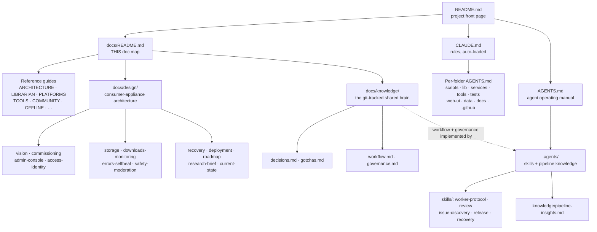

# Val Ark Documentation — the doc map

The **one canonical index** of every doc in the repo: what it is, where it lives, and where
to start. Val Ark is an online-optional, local-first mirror of dev/AI tools, AI models, and
offline content (ZIM via Kiwix), with a zero-dependency web UI.

## Start here

| I am… and I want to… | Go to |
|----------------------|-------|
| **A person** getting oriented | [`../README.md`](../README.md) — project front page |
| **An AI agent** about to make a change | [`../AGENTS.md`](../AGENTS.md) (operating manual) + the auto-loaded [`../CLAUDE.md`](../CLAUDE.md) |
| To know **why** something was built a certain way | [`knowledge/decisions.md`](knowledge/decisions.md) |
| To avoid a **known trap** while coding | [`knowledge/gotchas.md`](knowledge/gotchas.md) |
| To understand the **appliance design** | [`design/README.md`](design/README.md) |
| To **run the tests** | [`../tests/AGENTS.md`](../tests/AGENTS.md) |

## The documentation graph

Every important folder also carries its own `AGENTS.md` (local operating notes) and/or a
`README.md`; they are inventoried below.

## Master inventory

Every tracked `.md`, grouped. The source of truth for "did we document it?" is
`git ls-files '*.md'` — keep this table in sync with it (see [Keeping this map in
sync](#keeping-this-map-in-sync)).

### Root governance

| File | Purpose |
|------|---------|
| [`../README.md`](../README.md) | Project front page: overview, architecture diagrams, quick start. |
| [`../CLAUDE.md`](../CLAUDE.md) | Codebase guide + rules, **auto-loaded every session**; the "how to add a tool" checklist. |
| [`../AGENTS.md`](../AGENTS.md) | AI-agent operating manual: prime directives, the delivery pipeline, definition of done. |
| [`../CONTRIBUTING.md`](../CONTRIBUTING.md) | Contributor entry point; points at the authoritative workflow + knowledge base. |
| [`../SECURITY.md`](../SECURITY.md) | Security policy and trust posture (offline LAN/tailnet appliance, not internet-exposed). |

### docs/ — reference guides

| File | Purpose |
|------|---------|
| [ARCHITECTURE.md](ARCHITECTURE.md) | System architecture diagrams and component overview. |
| [COMMUNITY.md](COMMUNITY.md) | Offline community services: chat, mail, boards, and file drop. |
| [SECURITY-AUDIT.md](SECURITY-AUDIT.md) | Security audit and posture: repo, web server, scripts, runtime. |
| [ENCRYPTION.md](ENCRYPTION.md) | Local certificate authority and TLS for the offline LAN. |
| [LIBRARIAN.md](LIBRARIAN.md) | The self-filling, self-healing engine: scalable disk-fill, curation, and the 24/7 loop. |
| [TOOLS.md](TOOLS.md) | Catalog of the mirrored tools and their usage (source of truth: the web-ui TOOLS array / tests `TOOL_IDS`). |
| [PLATFORMS.md](PLATFORMS.md) | Supported platforms and chips, including builds and the OpenWRT subset. |
| [ARM64-NAS.md](ARM64-NAS.md) | ARM64 NAS appliances (chips such as the Rockchip RK3588): setup notes and gotchas. |
| [OFFLINE.md](OFFLINE.md) | Offline operation, P2P sync, and the NFS-shared mesh. |
| [OFFLINE-GAPS.md](OFFLINE-GAPS.md) | "Internet went off today" gap analysis: ranked missing tools, cold-start warnings, content roadmap. |
| [MODEL_INVENTORY.md](MODEL_INVENTORY.md) | Model families, tiers, and availability. |
| [AGENTS.md](AGENTS.md) | Operating notes for writing and maintaining these reference guides. |

### docs/design/ — consumer-appliance architecture (scope-first)

Start at [design/README.md](design/README.md). The scope-first set: [vision](design/vision.md) ·
[commissioning](design/commissioning.md) · [admin-console](design/admin-console.md) ·
[access-identity](design/access-identity.md) · [recovery](design/recovery.md) ·
[storage](design/storage.md) · [downloads-monitoring](design/downloads-monitoring.md) ·
[errors-selfheal](design/errors-selfheal.md) · [safety-moderation](design/safety-moderation.md) ·
[deployment](design/deployment.md) · [roadmap](design/roadmap.md) ·
[research-brief](design/research-brief.md) · [current-state](design/current-state.md).
Operating notes for editing this set: [design/AGENTS.md](design/AGENTS.md).

### docs/knowledge/ — the git-tracked shared brain

| File | Purpose |
|------|---------|
| [knowledge/README.md](knowledge/README.md) | How the shared brain works and where each kind of knowledge goes. |
| [knowledge/decisions.md](knowledge/decisions.md) | Architecturally significant decisions + progress log (context → decision → why). |
| [knowledge/gotchas.md](knowledge/gotchas.md) | Operational gotchas & hard-won fixes (symptom → cause → fix). |
| [knowledge/workflow.md](knowledge/workflow.md) | Git / branch / PR / parallelization strategy. |
| [knowledge/governance.md](knowledge/governance.md) | Self-guided agent governance, CI & trust model (implemented by `.agents/`). |
| [knowledge/AGENTS.md](knowledge/AGENTS.md) | Operating notes for baking learnings into the shared brain. |

### .agents/ — the agents' operating manual (skills + pipeline knowledge)

| File | Purpose |
|------|---------|
| [../.agents/README.md](../.agents/README.md) | Index of the agent skills + operational knowledge. |
| [../.agents/skills/worker-protocol.md](../.agents/skills/worker-protocol.md) | Implement one issue as a reviewable PR (branch → fix → test → PR). |
| [../.agents/skills/review.md](../.agents/skills/review.md) | Review a PR or release diff (Gate 1 / Gate 2). |
| [../.agents/skills/issue-discovery.md](../.agents/skills/issue-discovery.md) | Hunt for real, confirmed issues to file. |
| [../.agents/skills/release.md](../.agents/skills/release.md) | Cut a `dev → main` release and tag it. |
| [../.agents/skills/recovery.md](../.agents/skills/recovery.md) | Resume after a restart / limit / dead worker without losing work. |
| [../.agents/knowledge/pipeline-insights.md](../.agents/knowledge/pipeline-insights.md) | Hard-won operational insights about running the multi-agent pipeline. |

### Per-folder AGENTS.md + READMEs

Each important folder carries local operating notes. (`AGENTS.md` files are created across
this doc cleanup; the links resolve after integration.)

| Folder | Docs |
|--------|------|
| `scripts/` | [scripts/AGENTS.md](../scripts/AGENTS.md) · [scripts/README.md](../scripts/README.md) — orchestration, curation, server layer. |
| `scripts/lib/` | [scripts/lib/AGENTS.md](../scripts/lib/AGENTS.md) — data-root resolution + catalog/planner internals. |
| `scripts/services/` | [scripts/services/AGENTS.md](../scripts/services/AGENTS.md) — offline community service launchers (chat/mail/forum/paste/seaweedfs). |
| `scripts/tools/` | [scripts/tools/AGENTS.md](../scripts/tools/AGENTS.md) · [scripts/tools/README.md](../scripts/tools/README.md) — per-tool mirror scripts + `_common.sh` helpers. |
| `tests/` | [tests/AGENTS.md](../tests/AGENTS.md) · [tests/README.md](../tests/README.md) — one runner → offline HTML report. |
| `tests/screenshots/` | [tests/screenshots/AGENTS.md](../tests/screenshots/AGENTS.md) — Playwright specs, parametrized over the catalog. |
| `web-ui/` | [web-ui/AGENTS.md](../web-ui/AGENTS.md) · [web-ui/README.md](../web-ui/README.md) — zero-dep SPA (TOOLS array, TOOL_META, logos, screenshots). |
| `data/` | [data/AGENTS.md](../data/AGENTS.md) — `installers.tsv` + `models-extra.tsv` catalog format. |
| `docs/` | [docs/AGENTS.md](AGENTS.md) — the reference guides (this folder). |
| `docs/design/` | [docs/design/AGENTS.md](design/AGENTS.md) — the scope-first design set. |
| `docs/knowledge/` | [docs/knowledge/AGENTS.md](knowledge/AGENTS.md) — the shared brain. |
| `.github/` | [.github/AGENTS.md](../.github/AGENTS.md) — issue/PR templates + CI notes. |

### .github/ — templates

| File | Purpose |
|------|---------|
| [../.github/ISSUE_TEMPLATE/agent-task.md](../.github/ISSUE_TEMPLATE/agent-task.md) | Well-scoped, autonomous-agent-ready job (maintainer-authored). |
| [../.github/ISSUE_TEMPLATE/bug.md](../.github/ISSUE_TEMPLATE/bug.md) | Bug report template. |
| [../.github/ISSUE_TEMPLATE/feature.md](../.github/ISSUE_TEMPLATE/feature.md) | Feature request template. |
| [../.github/PULL_REQUEST_TEMPLATE.md](../.github/PULL_REQUEST_TEMPLATE.md) | One-focused-job PR template. |

## Key concepts

- **Configurable data root** — all bulk data lives on one disk resolved from a
  git-ignored `.env` (see [`.env.example`](../.env.example)) or autodetected; the
  repo's dirs are symlinked to it. Scales to any disk size. Logic in
  `scripts/lib/valark-env.sh`. See [LIBRARIAN.md](LIBRARIAN.md).
- **Librarian engine** — `scripts/librarian.sh` fills a disk from live catalogs
  in priority order (diversity → small-valuable → fill-remaining → evict-for-better),
  using aria2 multi-connection downloads with curl fallback. It curates roughly **250
  catalog items** across ~50 tool mirror scripts (`scripts/tools/*.sh`) plus models and
  offline content. See [LIBRARIAN.md](LIBRARIAN.md).
- **24/7 self-healing loop** — `scripts/loop.sh` + `scripts/verify.sh` repair
  symlinks, refresh the live Kiwix catalog, link-check, integrity-verify, top-up
  fill, and confirm apps actually run (including remote mesh nodes).
- **Mesh** — the data root is NFS-exportable so fleet nodes mount one shared
  mirror and run GPU inference over the network. See [OFFLINE.md](OFFLINE.md).
- **Web server** — `scripts/server.js` (zero-dep Node) serves the UI, a JSON API,
  and SSE, and auto-launches `kiwix-serve` for any complete ZIM. See
  [ARCHITECTURE.md](ARCHITECTURE.md).

## Keeping this map in sync

This is the **one canonical index** — keeping it current is part of the definition of done.
When you add, remove, or rename a tracked `.md`, update this file in the same change:

1. Add/adjust its row in the matching group above.
2. If it introduces a new folder, add the folder to the graph and the per-folder table.
3. Sanity-check with `git ls-files '*.md'` — every path it prints must appear here.

---

↑ [Repo root](../README.md) · [Agent manual](../AGENTS.md) · [Design](design/README.md) · [Knowledge base](knowledge/README.md) · [.agents](../.agents/README.md)
