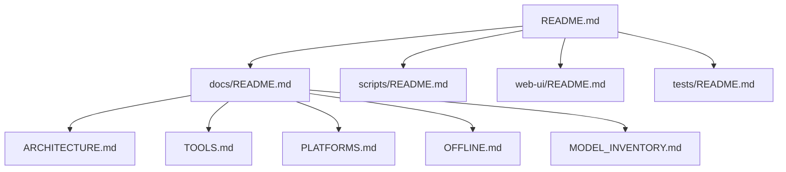

# Val Ark Documentation

This page serves as the navigation hub for all project documentation.

## Documentation Structure

## Quick Navigation

| Document | Description |
|----------|-------------|
| [ARCHITECTURE.md](ARCHITECTURE.md) | System architecture diagrams and component overview. |
| [TOOLS.md](TOOLS.md) | Complete catalog of available tools and their usage. |
| [PLATFORMS.md](PLATFORMS.md) | Platform-specific notes covering supported environments and configurations. |
| [OFFLINE.md](OFFLINE.md) | Guide for offline operation and peer-to-peer functionality. |
| [MODEL_INVENTORY.md](MODEL_INVENTORY.md) | Model details, tiers, and availability information. |

## Related Sections

- [scripts/README.md](../scripts/README.md) - Script utilities and automation
- [web-ui/README.md](../web-ui/README.md) - Web interface documentation
- [tests/README.md](../tests/README.md) - Test suite and coverage

---

[Back to Project Root](../README.md)
