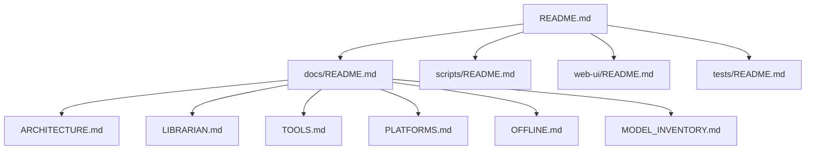

# Val Ark Documentation

Navigation hub for all project documentation. Val Ark is an online-optional,
local-first mirror of dev/AI tools, AI models, and offline content (ZIM via
Kiwix), with a zero-dependency web UI.

## Documentation Structure

## Quick Navigation

| Document | Description |
|----------|-------------|
| [ARCHITECTURE.md](ARCHITECTURE.md) | System architecture diagrams and component overview. |
| [LIBRARIAN.md](LIBRARIAN.md) | The self-filling, self-healing engine: scalable disk-fill, curation, and the 24/7 loop. |
| [TOOLS.md](TOOLS.md) | Catalog of the 43 mirrored tools and their usage. |
| [PLATFORMS.md](PLATFORMS.md) | Supported platforms and chips, including builds and the OpenWRT subset. |
| [OFFLINE.md](OFFLINE.md) | Offline operation, P2P sync, and the NFS-shared mesh. |
| [MODEL_INVENTORY.md](MODEL_INVENTORY.md) | Model families, tiers, and availability. |

## Key Concepts

- **Configurable data root** — all bulk data lives on one disk resolved from a
  git-ignored `.env` (see [`.env.example`](../.env.example)) or autodetected; the
  repo's dirs are symlinked to it. Scales to any disk size. Logic in
  `scripts/lib/valark-env.sh`. See [LIBRARIAN.md](LIBRARIAN.md).
- **Librarian engine** — `scripts/librarian.sh` fills a disk from live catalogs
  in priority order (diversity → small-valuable → fill-remaining → evict-for-better),
  using aria2 multi-connection downloads with curl fallback. See [LIBRARIAN.md](LIBRARIAN.md).
- **24/7 self-healing loop** — `scripts/loop.sh` + `scripts/verify.sh` repair
  symlinks, refresh the live Kiwix catalog, link-check, integrity-verify, top-up
  fill, and confirm apps actually run (including remote mesh nodes).
- **Mesh** — the data root is NFS-exportable so fleet nodes mount one shared
  mirror and run GPU inference over the network. See [OFFLINE.md](OFFLINE.md).
- **Web server** — `scripts/server.js` (zero-dep Node) serves the UI, a JSON API,
  and SSE, and auto-launches `kiwix-serve` for any complete ZIM. See
  [ARCHITECTURE.md](ARCHITECTURE.md).

## Related Sections

- [scripts/README.md](../scripts/README.md) - Script utilities and automation
- [web-ui/README.md](../web-ui/README.md) - Web interface documentation
- [tests/README.md](../tests/README.md) - Test suite and coverage

---

[Back to Project Root](../README.md)
