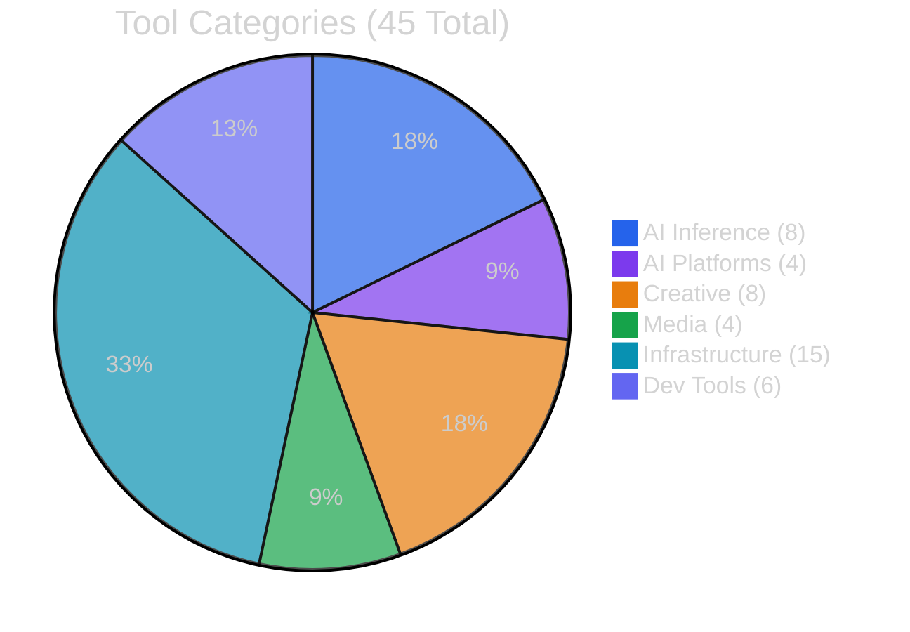

# Val Ark - Tools Catalog (45 Tools)

[Back to Docs](README.md) | [Back to Project Root](../README.md)

---

## AI Inference (8)

Local inference engines for running AI models directly on hardware without cloud dependencies.

| # | Tool | Description | Platforms | Method | License |
|---|------|-------------|-----------|--------|---------|
| 1 | **llama.cpp** | LLM/VLM inference engine for GGUF quantized models with GPU offloading | arm64, x86_64, mac, windows | Prebuilt binary (mac/win), source build (Linux CUDA) | MIT |
| 2 | **whisper.cpp** | Fast speech-to-text using OpenAI Whisper models in C/C++ | arm64, x86_64, mac, windows | Prebuilt binary (win), source build (Linux CUDA / mac Metal) | MIT |
| 3 | **Piper TTS** | Fast neural text-to-speech with VITS/ONNX models, 51 languages | arm64, x86_64, mac, windows | Prebuilt binary | MIT |
| 4 | **stable-diffusion.cpp** | Image generation from text prompts (SD 1.x, SDXL, SD3.5, FLUX, Wan2.1) | arm64, x86_64, mac, windows | Prebuilt binary (mac/win), source build (Linux CUDA) | MIT |
| 5 | **ONNX Runtime** | Inference runtime for Kokoro TTS, Silero VAD, Moonshine ASR, and ONNX models | arm64, x86_64, mac, windows | Prebuilt binary | MIT |
| 6 | **Vosk** | Lightweight offline speech recognition (Kaldi-based), 30+ languages, streaming | arm64, x86_64, mac, windows | Prebuilt binary / pip | Apache-2.0 |
| 7 | **BitNet.cpp** | 1-bit (ternary) LLM inference, 2-6x CPU speedup over FP16 | arm64, x86_64, mac, windows | Source build (Python setup) | MIT |
| 8 | **Ollama** | Model manager and server for local LLMs with pull/run/serve workflow | arm64, x86_64, mac, windows | Prebuilt binary | MIT |

---

## AI Platforms (4)

Higher-level AI services, workflow systems, and model management interfaces.

| # | Tool | Description | Platforms | Method | License |
|---|------|-------------|-----------|--------|---------|
| 9 | **n8n** | Workflow automation platform with AI nodes, connects to Ollama/llama.cpp | arm64, x86_64 | npm / Docker | Sustainable Use |
| 10 | **Milvus** | Vector database for embeddings, similarity search, and RAG pipelines | x86_64 | pip (Milvus Lite) / Docker | Apache-2.0 |
| 11 | **ComfyUI** | Node-based image/video generation workflow editor using sd.cpp models | arm64, x86_64, mac, windows | pip / source (Python) | GPL-3.0 |
| 12 | **Open WebUI** | ChatGPT-style web interface for Ollama and local LLMs with RAG support | arm64, x86_64, mac, windows | pip / Docker | MIT |

---

## Creative (8)

Design, modeling, content creation, and editing tools with scripting capabilities.

| # | Tool | Description | Platforms | Method | License |
|---|------|-------------|-----------|--------|---------|
| 13 | **Blender** | 3D modeling, animation, rendering with Python scripting API (bpy) | x86_64, mac, windows | Prebuilt binary | GPL-2.0+ |
| 14 | **FreeCAD** | Parametric 3D CAD modeler with headless mode (FreeCADCmd) and Python API | x86_64, mac, windows | Prebuilt binary | LGPL-2.1+ |
| 15 | **KiCad** | PCB/schematic EDA suite with kicad-cli for headless Gerber/BOM/DRC export | x86_64, mac, windows | Prebuilt binary (universal DMG / exe), package manager (Linux) | GPL-3.0+ |
| 16 | **Godot Engine** | 2D/3D game engine with GDScript, headless export, and CI integration | arm64, x86_64, mac, windows | Prebuilt binary | MIT |
| 17 | **GIMP** | Raster image editor with batch processing via Script-Fu and Python-Fu | arm64, x86_64, mac, windows | Prebuilt binary (AppImage/DMG/exe) | GPL-3.0 |
| 18 | **Inkscape** | Vector graphics editor (SVG) with CLI export to PDF/PNG/EPS | x86_64, mac, windows | Prebuilt binary (AppImage/DMG/exe) | GPL-2.0+ |
| 19 | **Kdenlive** | Non-linear video editor with multi-track timeline, effects, and titling | x86_64, mac, windows | Prebuilt binary (AppImage/DMG/exe) | GPL-3.0 |
| 20 | **Calibre** | E-book library manager, format converter, and content server | arm64, x86_64, mac, windows | Prebuilt binary | GPL-3.0 |

---

## Media (4)

Media playback, recording, download, and conversion tools.

| # | Tool | Description | Platforms | Method | License |
|---|------|-------------|-----------|--------|---------|
| 21 | **FFmpeg** | Audio/video processing, transcoding, streaming, and frame extraction | arm64, x86_64, mac, windows | Prebuilt binary | LGPL-2.1+ |
| 22 | **VLC** | Universal media player with CLI transcoding and HTTP streaming (cvlc) | arm64, x86_64, mac, windows | Prebuilt binary | GPL-2.0+ |
| 23 | **Audacity** | Multi-track audio editor with recording, effects, and noise reduction | x86_64, mac, windows | Prebuilt binary / package manager | GPL-3.0 |
| 24 | **yt-dlp** | Video/audio downloader supporting 1000+ sites with format selection | arm64, x86_64, mac, windows | Prebuilt binary | Unlicense |

---

## Infrastructure (15)

Networking, sync, databases, monitoring, self-hosting, and IoT messaging.

| # | Tool | Description | Platforms | Method | License |
|---|------|-------------|-----------|--------|---------|
| 25 | **SeaweedFS** | Distributed object/file store with S3-compatible API - fast blob layer for the fleet | arm64, x86_64, mac, windows | Prebuilt binary | Apache-2.0 |
| 26 | **Syncthing** | Peer-to-peer continuous file synchronization across devices | arm64, x86_64, mac, windows | Prebuilt binary | MPL-2.0 |
| 27 | **Coolify** | Self-hosted PaaS for deploying apps, databases, and services with Git push | x86_64 | Docker / install script | Apache-2.0 |
| 28 | **Kiwix** | Offline content server for ZIM archives (Wikipedia, StackOverflow, etc.) | arm64, x86_64, mac, windows | Prebuilt binary | GPL-3.0 |
| 29 | **Tailscale** | Mesh VPN / overlay network with zero-config device connectivity | arm64, x86_64, mac, windows | Prebuilt binary | BSD-3-Clause |
| 30 | **Mosquitto** | Lightweight MQTT broker and clients for IoT device messaging | arm64 | Source build (compiled) | EPL-2.0 / EDL-1.0 |
| 31 | **MQTT Explorer** | Visual GUI MQTT client for browsing topics and debugging IoT data flows | arm64, x86_64, mac, windows | Prebuilt binary (AppImage/DMG/exe) | CC-BY-ND-4.0 |
| 32 | **Redis** | In-memory key-value store for caching, pub/sub, and session management | arm64 | Source build (compiled) | RSALv2 / SSPLv1 |
| 33 | **PostgreSQL** | Relational database with pgvector extension for AI embeddings | arm64 | Source build (compiled) | PostgreSQL License |
| 34 | **InfluxDB** | Time-series database (OSS 2.x) for metrics and IoT data, mirrored with the influx CLI | arm64, x86_64, mac, windows | Prebuilt binary | MIT / Apache-2.0 |
| 35 | **Grafana** | Observability dashboards for InfluxDB, Prometheus, and 150+ data sources | arm64, x86_64, mac, windows | Prebuilt binary | AGPL-3.0 |
| 36 | **Telegraf** | Metrics collection agent with 300+ plugins for system and app monitoring | arm64, x86_64, mac, windows | Prebuilt binary | MIT |
| 37 | **SQLite** | Embedded SQL database CLI for experiment tracking, logs, and local storage | arm64, x86_64, windows | Prebuilt binary | Public Domain |
| 38 | **btop** | Interactive system/resource monitor with CPU, GPU, memory, and process views | arm64, x86_64, mac, windows | Prebuilt binary | Apache-2.0 |
| 39 | **tmux** | Terminal multiplexer with session persistence, splits, and remote attach | arm64, x86_64, mac | Prebuilt binary (static) | ISC |

---

## Dev Tools (6)

Editors, runtimes, CLI utilities, and AI coding assistants.

| # | Tool | Description | Platforms | Method | License |
|---|------|-------------|-----------|--------|---------|
| 40 | **Helix** | Modal text editor (Rust) with built-in LSP, tree-sitter, and multi-cursor | arm64, x86_64, mac, windows | Prebuilt binary | MPL-2.0 |
| 41 | **VSCodium** | Open-source VS Code (telemetry-free) with Open VSX extension registry | arm64, x86_64, mac, windows | Prebuilt binary | MIT |
| 42 | **Miniforge** | Conda-forge distribution for managing Python environments and packages offline | arm64, x86_64, mac, windows | Prebuilt installer | BSD-3-Clause |
| 43 | **Python Standalone** | Portable CPython build with no system dependencies, pip included | arm64, x86_64, mac, windows | Prebuilt binary | MPL-2.0 |
| 44 | **Dev CLI Bundle** | ripgrep, fd, bat, jq, fzf, lazygit bundled as portable CLI dev tools | arm64, x86_64, mac, windows | Prebuilt binary | MIT / Apache-2.0 |
| 45 | **Claude Code** | Anthropic's agentic coding CLI, works offline via Ollama or llama.cpp backend | arm64, x86_64, mac, windows | npm | Proprietary |

---

## Platform Support Matrix

All aarch64 boards (Jetson Orin, Jetson Thor, GB10) and OpenWRT routers share the
**same `tools/linux-arm64` artifacts**. See [PLATFORMS.md](PLATFORMS.md) for per-board
CUDA profiles and setup.

| Platform | Architecture | Examples / Notes |
|----------|-------------|------------------|
| linux-arm64 | ARM64 | Jetson Orin / Thor, GB10 Grace-Blackwell (SBSA), Raspberry Pi |
| linux-x86_64 | x86_64 | Ubuntu, Debian, Arch, Fedora |
| macos-arm64 | Apple Silicon | M1 / M2 / M3 / M4 |
| windows-x64 | x86_64 | Windows 10 / 11 |
| openwrt | ARM64 | Router nodes — content / sync / infra subset only (no inference engines) |

**Mesh:** the data disk is NFS-exportable, so fleet nodes can mount one shared mirror
and run GPU inference on the served models over the network. The 24/7 verify loop
(`scripts/verify.sh`) checks this; see [ARCHITECTURE.md](ARCHITECTURE.md).

---

## Download Methods

| Method | Description |
|--------|-------------|
| Prebuilt binary | Static binary or portable archive, runs immediately |
| Source build | Compiled from source with platform-specific flags (CUDA, Metal) |
| pip | Python package installed via pip into a virtualenv |
| npm | Node.js package installed globally via npm |
| Docker | Container image pulled and run via Docker/Compose |
| Package manager | Installed via apt, brew, or flatpak |

---

## Build From Source

There is **no upstream prebuilt aarch64 CUDA binary** for llama.cpp, whisper.cpp, or
stable-diffusion.cpp, so GPU acceleration on Jetson / GB10 requires a source build.
`scripts/download-tools.sh` clones the source repos; you then compile with the right
acceleration flag for your platform:

| Platform | Flag | Notes |
|----------|------|-------|
| Jetson Orin | `-DGGML_CUDA=ON -DCMAKE_CUDA_ARCHITECTURES=87` | SM 8.7 |
| Jetson Thor / GB10 | `-DGGML_CUDA=ON -DCMAKE_CUDA_ARCHITECTURES=110` | Blackwell |
| Linux x86_64 | `-DGGML_CUDA=ON` | CUDA auto-detect; CPU build also auto-tunes AVX2/AVX-512/FMA |
| macOS | `-DGGML_METAL=ON` | Metal (llama.cpp / sd.cpp prebuilt already include it) |

See [PLATFORMS.md](PLATFORMS.md) for full per-board build commands.

---

## Related Docs

- [LIBRARIAN.md](LIBRARIAN.md) — the librarian engine that auto-fills the mirror disk
- [PLATFORMS.md](PLATFORMS.md) — per-platform setup and CUDA/Metal builds
- [ARCHITECTURE.md](ARCHITECTURE.md) — system architecture, the 24/7 self-healing loop, and the NFS mesh
- [MODEL_INVENTORY.md](MODEL_INVENTORY.md) — AI model catalog and tiers
