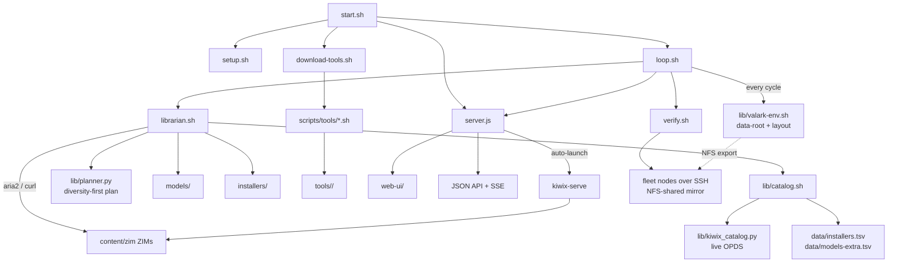

# Scripts

Orchestration, curation, and server layer for Val Ark. All scripts resolve their
data location through `lib/valark-env.sh`, so they can be run from the project root
or from this directory.

## Architecture



## Data Root (`lib/valark-env.sh`)

Every script sources `lib/valark-env.sh` to learn **where** Val Ark keeps data. It
resolves `DATA_ROOT` from `$VAL_ARK_DATA` (set in the git-ignored `.env` — see
[`.env.example`](../.env.example)), else autodetects the largest writable mount,
else falls back to the repo directory for single-disk/dev use. Models live at
`<root>/models`; everything else under `<root>/val-ark/{tools,content,sources,assets,installers,state}`.
Repo-relative dirs are symlinked onto the disk so legacy scripts keep working, and
the layout scales to any disk size. The data disk is NFS-exportable so a fleet can
mount one shared mirror — see [Platforms](../docs/PLATFORMS.md).

## Script Reference

| Script | Purpose |
|--------|---------|
| `setup.sh` | First-run dependency checks and directory creation |
| `update.sh` | Pull latest changes and re-run setup if needed |
| `librarian.sh` | Scalable, diversity-first disk-fill + curation engine (see below) |
| `loop.sh` | 24/7 self-healing + verification cycle; installs a cron driver |
| `verify.sh` | Functional checks: tools run, kiwix serves, LLM infers, fleet reachable |
| `download-tools.sh` | Orchestrates tool downloads via `scripts/tools/*.sh` |
| `download-models.sh` | Curated AI model downloads to `<root>/models/` (resumable, never aborts) |
| `download-zims.sh` | Direct ZIM content downloads for Kiwix |
| `server.js` | Zero-dependency Node.js server: web UI + JSON API + SSE; auto-serves Kiwix |
| `audit-tools.sh` | Report mirrored vs. missing tool binaries per platform |
| `monitor.sh` | Watch active downloads and disk usage |
| `status.sh` | Print current state of downloads, tools, and disk |
| `retry-failed.sh` | Re-attempt previously failed model downloads |
| `release.sh` | Tag a release (`./release.sh 1.2.0 [--push]`) |
| `screenshots.sh` | Capture web/terminal screenshots for docs |
| `optimize-images.py` | Compress/resize web-ui screenshots and logos |
| `uninstall.sh` | Remove Val Ark config (leaves models and tools intact) |

Shared library under `lib/`:

| File | Purpose |
|------|---------|
| `lib/valark-env.sh` | Resolve data root, layout, disk math, writability self-heal, URL checks |
| `lib/catalog.sh` | Unify live ZIM + model + installer download candidates |
| `lib/kiwix_catalog.py` | Fetch the live Kiwix OPDS feed → TSV (no stale dates ever) |
| `lib/planner.py` | Order candidates into a diversity-first download plan |

## Librarian (`librarian.sh`)

Fills a disk of **any size** from live catalogs in priority order:
`diversity → small-valuable → fill-remaining → evict-for-better`. Downloads prefer
**aria2** multi-connection (~3× faster on per-connection-throttled mirrors) with a
curl fallback; both resume, retry, verify size, atomic-rename, and never abort on a
single failure. A single `flock` prevents concurrent fills from racing.

```bash
./librarian.sh status              # disk + coverage summary
./librarian.sh plan [--budget B]   # dry-run: print the ordered plan
./librarian.sh fill [opts]         # execute the plan, bounded
./librarian.sh verify              # integrity-check managed files; requeue bad
./librarian.sh evict --need BYTES  # free space (lowest value/byte, protect diversity)
./librarian.sh maintain            # refresh + verify + bounded top-up + health report
./librarian.sh refresh             # refresh the live Kiwix catalog cache
```

`fill`/`maintain` accept `--max-bytes B`, `--max-items N`, `--time SECONDS`, and
`--budget B`. See [`docs/LIBRARIAN.md`](../docs/LIBRARIAN.md) for the full model.

## 24/7 Loop (`loop.sh`)

One cycle is safe to run repeatedly and concurrently with a standalone fill. In order:
ensure the data disk is writable → repair the symlink layout → ensure the web server
(and Kiwix) is up → refresh the live catalog (heals content links) → link-check + repair
→ integrity verify → bounded top-up fill → functional verification → health report.

```bash
./loop.sh once             # one maintenance cycle (cron / manual)
./loop.sh run [SECS]       # run forever, sleeping SECS between cycles (default 1800)
./loop.sh install [MIN]    # register a flock-guarded cron (default every 30 min)
./loop.sh uninstall        # remove the cron entries
```

## Verify (`verify.sh`)

Confirms apps actually **run**, best-effort and non-destructively: native tool
binaries answer `--version`, `kiwix-serve` serves a real ZIM, a tiny LLM infers via
`llama.cpp`, and the Val Ark web API responds. With `VALARK_FLEET` set in `.env`, it
also SSHes each remote node to confirm it mounts the shared mirror and can run GPU
inference on a model served over NFS.

```bash
./verify.sh [local|fleet|all]      # default: all
```

## Tool Scripts (`scripts/tools/`)

There are **43** self-contained tool download scripts (e.g. `llama-cpp.sh`, `piper.sh`,
`ffmpeg.sh`). Each sources `_common.sh` for shared helpers (logging, retrying
downloads, platform detection, GitHub release lookup) and defines a
`download_<tool>()` function. `download-tools.sh` discovers them automatically:

```bash
./download-tools.sh list           # List available tools
./download-tools.sh llama-cpp      # Download a specific tool
./download-tools.sh all            # Download everything (smallest first)
./download-tools.sh validate       # Run any per-tool URL validators
```

Outputs land in `tools/<platform>/<tool>/` where platform is one of
`linux-arm64` (Jetson Orin/Thor, GB10, Raspberry Pi), `linux-x86_64`, `macos-arm64`,
or `windows-x64`. GPU-accelerated llama/whisper/sd on aarch64 need a CUDA source
build (no upstream binary). See [`tools/README.md`](tools/README.md) and
[Platforms](../docs/PLATFORMS.md).

## server.js

A zero-dependency Node.js HTTP server (no `npm install`). It serves the static
`web-ui/` directory, exposes a JSON API plus an SSE stream for live download
status/inventory, and auto-launches `kiwix-serve` for any complete `.zim` in
`content/zim`. Default port is `3000`; override with the first argument:
`node scripts/server.js 8080`. The loop and verify scripts read the same port from
`VALARK_WEB_PORT` (`.env`).

---

[Back to Project Root](../README.md) | [Tool Scripts](tools/README.md) | [Architecture](../docs/ARCHITECTURE.md)
