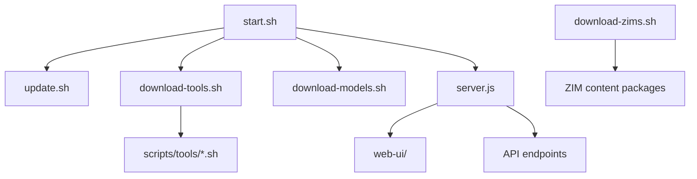

# Scripts

Orchestration and server layer for Val Ark. All scripts assume they are run from the project root or from this directory.

## Architecture



## Script Reference

| Script | Purpose |
|--------|---------|
| `setup.sh` | First-run environment setup and dependency checks |
| `update.sh` | Pull latest changes and re-run setup if needed |
| `download-tools.sh` | Orchestrates tool downloads via `scripts/tools/*.sh` |
| `download-models.sh` | Downloads AI model files to `~/models/` |
| `download-zims.sh` | Downloads ZIM content archives for offline use |
| `server.js` | Zero-dependency Node.js server: web UI + REST API |
| `monitor.sh` | Watch active downloads and system resource usage |
| `status.sh` | Print current state of all downloads and tools |
| `retry-failed.sh` | Re-attempt any previously failed downloads |
| `release.sh` | Package a release archive |
| `screenshots.sh` | Capture UI screenshots for documentation |
| `uninstall.sh` | Remove installed tools and models cleanly |

## Tool Scripts Pattern

Each tool in `scripts/tools/` is a self-contained download script (e.g., `llama-cpp.sh`, `piper.sh`, `ffmpeg.sh`). All tool scripts source `_common.sh` for shared helpers:

- Logging (`log_info`, `log_error`, `log_success`)
- Download with retry and checksum verification
- Architecture/platform detection
- Directory and path management

`download-tools.sh` discovers these scripts automatically. You can run any tool script independently or use the orchestrator:

```bash
./download-tools.sh list           # List available tools
./download-tools.sh llama-cpp      # Download a specific tool
./download-tools.sh all            # Download everything
./download-tools.sh validate       # Check all URLs are reachable
```

## server.js

A zero-dependency Node.js HTTP server (no npm install required). It serves the static `web-ui/` directory and exposes API endpoints for:

- Download status and progress
- Tool/model inventory
- Triggering and controlling downloads

Default port is `3000`, override via first argument: `node scripts/server.js 8080`.

---

[Back to Project Root](../README.md) | [Tool Scripts](tools/README.md)
