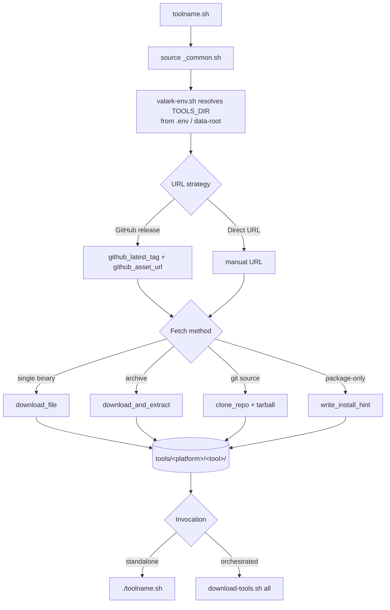

# Tool Download Scripts

Each tool has its own Bash script here. Every script sources `_common.sh` for shared download helpers, then defines a `download_<tool>()` function that mirrors platform-specific binaries (or clones source for tools without portable builds).

Run a script standalone (`./btop.sh`) or orchestrate them via the parent [`download-tools.sh`](../download-tools.sh):

```bash
./download-tools.sh list        # List available tools
./download-tools.sh llama-cpp   # Mirror a specific tool
./download-tools.sh all         # Mirror everything
./download-tools.sh validate    # Check all download URLs
```

> These scripts only mirror the *application binaries*. AI models and offline ZIM content are filled by the **librarian engine** — see [`docs/LIBRARIAN.md`](../../docs/LIBRARIAN.md). The librarian uses aria2 multi-connection downloads; these tool scripts use plain `curl`/`wget` with retries.

## Lifecycle



## Output Location

`TOOLS_DIR` is resolved by [`../lib/valark-env.sh`](../lib/valark-env.sh): it reads `VAL_ARK_DATA` from a git-ignored `.env` (see [`.env.example`](../../.env.example)), otherwise autodetects the largest mount, otherwise falls back to the repo. Binaries land in `tools/<platform>/<tool>/` (the repo-relative `tools/` is symlinked to the data-root so this path is stable regardless of disk).

Platform directories:

| Directory | Architecture | Hardware |
|-----------|--------------|----------|
| `linux-x86_64` | x86_64 | Ubuntu / Debian / Fedora |
| `linux-arm64` | aarch64 | Jetson Orin / Jetson Thor / GB10 Grace-Blackwell, Raspberry Pi |
| `macos-arm64` | Apple Silicon | M-series |
| `windows-x64` | x86_64 | Windows 10/11 |

GPU-accelerated tools (`llama-cpp`, `whisper-cpp`, `sd-cpp`, `bitnet`) ship prebuilt binaries where available but clone **source** for `linux-arm64` because no upstream aarch64+CUDA build exists — these are compiled on the Jetson/GB10 host.

## Tool Scripts

| Script | Tool | Platforms |
|--------|------|-----------|
| `audacity.sh` | Audacity | linux-x86_64, linux-arm64, macos-arm64, windows-x64 |
| `bitnet.sh` | BitNet.cpp | all (source) |
| `blender.sh` | Blender | linux-x86_64, linux-arm64, macos-arm64, windows-x64 |
| `btop.sh` | btop | linux-arm64, linux-x86_64, macos-arm64 |
| `calibre.sh` | Calibre | linux-x86_64, linux-arm64, macos-arm64, windows-x64 |
| `claude-code.sh` | Claude Code | linux-arm64, linux-x86_64, macos-arm64, windows-x64 |
| `comfyui.sh` | ComfyUI | linux-x86_64, linux-arm64, macos-arm64 |
| `coolify.sh` | Coolify | linux-arm64, linux-x86_64, macos-arm64, windows-x64 |
| `dev-cli.sh` | Dev CLI bundle (fd, rg, bat, fzf, jq, lazygit) | linux-arm64, linux-x86_64 |
| `ffmpeg.sh` | FFmpeg | linux-arm64, linux-x86_64, macos-arm64, windows-x64 |
| `freecad.sh` | FreeCAD | linux-x86_64, linux-arm64, macos-arm64, windows-x64 |
| `gimp.sh` | GIMP | linux-x86_64, linux-arm64, macos-arm64, windows-x64 |
| `godot.sh` | Godot Engine | linux-x86_64, linux-arm64, macos-arm64, windows-x64 |
| `helix.sh` | Helix editor | linux-arm64, linux-x86_64, macos-arm64, windows-x64 |
| `influxdb.sh` | InfluxDB | linux-arm64, linux-x86_64, macos-arm64, windows-x64 |
| `inkscape.sh` | Inkscape | linux-x86_64, linux-arm64, macos-arm64, windows-x64 |
| `kdenlive.sh` | Kdenlive | linux-arm64, macos-arm64, windows-x64 |
| `kicad.sh` | KiCad | linux-arm64, linux-x86_64, macos-arm64, windows-x64 |
| `kiwix.sh` | Kiwix Tools | linux-arm64, linux-x86_64, macos-arm64, windows-x64 |
| `llama-cpp.sh` | llama.cpp | macos-arm64, windows-x64, linux-x86_64; linux-arm64 (source) |
| `milvus.sh` | Milvus | linux-arm64, linux-x86_64, macos-arm64, windows-x64 |
| `miniforge.sh` | Miniforge | linux-arm64, linux-x86_64, macos-arm64, windows-x64 |
| `mosquitto.sh` | Mosquitto MQTT | linux-arm64, linux-x86_64, macos-arm64, windows-x64 |
| `mqtt-explorer.sh` | MQTT Explorer | linux-x86_64, linux-arm64, macos-arm64, windows-x64 |
| `n8n.sh` | n8n | linux-arm64, linux-x86_64, macos-arm64, windows-x64 |
| `ollama.sh` | Ollama | linux-arm64, linux-x86_64, macos-arm64, windows-x64 |
| `onnxruntime.sh` | ONNX Runtime | linux-arm64, linux-x86_64, macos-arm64, windows-x64 |
| `open-webui.sh` | Open WebUI | linux-arm64, linux-x86_64, macos-arm64, windows-x64 |
| `piper.sh` | Piper TTS | linux-arm64, linux-x86_64, macos-arm64, windows-x64 |
| `postgresql.sh` | PostgreSQL | linux-arm64, linux-x86_64, macos-arm64, windows-x64 |
| `python-standalone.sh` | Python Standalone | linux-arm64, linux-x86_64, macos-arm64, windows-x64 |
| `redis.sh` | Redis | linux-arm64, linux-x86_64, macos-arm64, windows-x64 |
| `sd-cpp.sh` | stable-diffusion.cpp | macos-arm64, windows-x64, linux-x86_64; linux-arm64 (source) |
| `sqlite.sh` | SQLite | linux-arm64, linux-x86_64, windows-x64 |
| `syncthing.sh` | Syncthing | linux-arm64, linux-x86_64, macos-arm64, windows-x64 |
| `tailscale.sh` | Tailscale | linux-arm64, linux-x86_64, macos-arm64, windows-x64 |
| `telegraf.sh` | Telegraf | linux-arm64, macos-arm64, windows-x64 |
| `tmux.sh` | tmux | linux-arm64, linux-x86_64, macos-arm64 |
| `vlc.sh` | VLC | linux-arm64, linux-x86_64, macos-arm64, windows-x64 |
| `vosk.sh` | Vosk | linux-arm64, linux-x86_64, macos-arm64, windows-x64 |
| `vscodium.sh` | VSCodium | linux-arm64, linux-x86_64, macos-arm64, windows-x64 |
| `whisper-cpp.sh` | whisper.cpp | windows-x64, macos-arm64, linux-x86_64; linux-arm64 (source) |
| `yt-dlp.sh` | yt-dlp | linux-x86_64, linux-arm64, macos-arm64, windows-x64 |

43 tool scripts in total.

## Shared Helpers (`_common.sh`)

| Function | Purpose |
|----------|---------|
| `github_latest_tag REPO FALLBACK` | Resolve the latest release tag via the GitHub API; falls back to the pinned version on failure. |
| `github_asset_url REPO TAG PATTERN` | Find a release asset URL matching a grep pattern for the given tag. |
| `download_file URL DEST [LABEL]` | Download a single file with retries (skips if already present). |
| `download_and_extract URL DEST [LABEL] [STRIP]` | Download an archive and extract it (tar.gz/xz/zst, zip, AppImage; rotates `.dist` archive copies). |
| `clone_repo URL REF DEST [LABEL]` | Shallow-clone a git repo at a tag/branch, then build an offline `.tar.gz`. |
| `write_install_hint DIR TOOL INSTRUCTIONS` | Write an `INSTALL.txt` for tools that require package-manager installation. |
| `ensure_dir PATH` | Create a directory (handles a file existing at the path). |

Environment variables: `GITHUB_TOKEN` (optional, raises API rate limits), `MAX_RETRIES` (default 5), `RETRY_DELAY` (default 15s). Downloads are idempotent — existing files are skipped, so re-running is safe and is exactly what the [24/7 self-healing loop](../loop.sh) relies on to top up a mirror.

## Adding a New Tool

A tool script is the *first* of several files to touch — see the full checklist in [`CLAUDE.md`](../../CLAUDE.md). Minimal template:

```bash
#!/bin/bash
source "$(dirname "$0")/_common.sh"

TOOL_NAME="mytool"
PINNED_VERSION="v1.0.0"

download_mytool() {
    log "Downloading ${TOOL_NAME}..."

    local repo="owner/mytool"
    local tag=$(github_latest_tag "$repo" "$PINNED_VERSION")

    # linux-arm64
    local url
    url=$(github_asset_url "$repo" "$tag" "linux.*arm64.*tar.gz")
    [ -n "$url" ] && download_and_extract "$url" "${TOOLS_DIR}/linux-arm64/mytool" "mytool linux-arm64" 1

    # linux-x86_64
    url=$(github_asset_url "$repo" "$tag" "linux.*amd64.*tar.gz")
    [ -n "$url" ] && download_and_extract "$url" "${TOOLS_DIR}/linux-x86_64/mytool" "mytool linux-x86_64" 1

    log_success "${TOOL_NAME} download complete."
}

# Run if called directly
[ "${BASH_SOURCE[0]}" = "$0" ] && download_mytool
```

Key points:
- Source `_common.sh` at the top; write to `${TOOLS_DIR}/<platform>/<tool>/` (never hardcode an absolute path — `TOOLS_DIR` is resolved for you).
- Use `github_latest_tag` for a reproducible fallback and `github_asset_url` to match release assets.
- For tools without portable binaries, `clone_repo` the source or `write_install_hint` instead.
- Guard standalone execution with the `BASH_SOURCE` check at the bottom.

---

[Back to Scripts](../README.md) | [Project Root](../../README.md) | [Librarian Engine](../../docs/LIBRARIAN.md)
