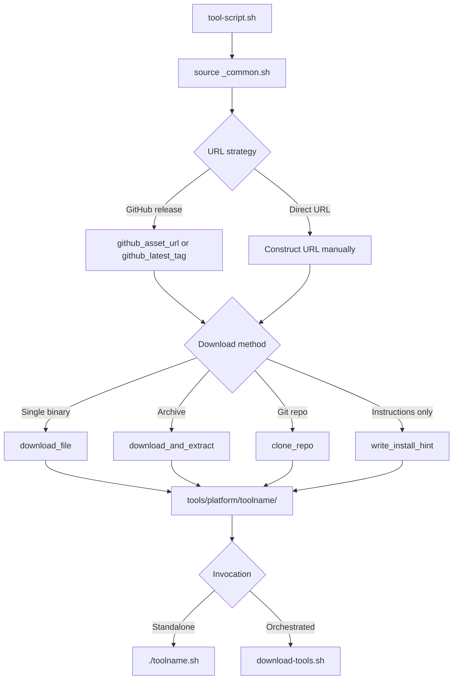

# Tool Download Scripts

Each tool has its own Bash script in this directory. Every script sources `_common.sh` to access shared download helpers, then defines a `download_<tool>()` function that fetches platform-specific binaries or source archives.

Scripts can be invoked standalone (`./btop.sh`) or orchestrated together via the parent `download-tools.sh` script.

## Lifecycle



## Tool Scripts

| Script | Tool | Platforms |
|--------|------|-----------|
| `audacity.sh` | Audacity | linux-x86_64, linux-arm64, macos-arm64, windows-x64 |
| `bitnet.sh` | BitNet.cpp | linux-arm64 (source) |
| `blender.sh` | Blender | linux-x86_64, linux-arm64, macos-arm64, windows-x64 |
| `btop.sh` | btop | linux-arm64, linux-x86_64, macos-arm64 |
| `calibre.sh` | Calibre | linux-x86_64, linux-arm64, macos-arm64, windows-x64 |
| `claude-code.sh` | Claude Code | linux-arm64, linux-x86_64, macos-arm64, windows-x64 |
| `comfyui.sh` | ComfyUI | linux-x86_64, linux-arm64, macos-arm64 |
| `coolify.sh` | Coolify | linux-arm64, linux-x86_64, macos-arm64, windows-x64 |
| `dev-cli.sh` | Dev CLI bundle (fd, rg, bat, fzf, jq, lazygit) | linux-arm64, linux-x86_64 |
| `ffmpeg.sh` | FFmpeg | linux-arm64, linux-x86_64, macos-arm64, windows-x64 |
| `freecad.sh` | FreeCAD | linux-x86_64, linux-arm64, macos-arm64, windows-x64 |
| `gimp.sh` | GIMP | linux-x86_64, linux-arm64, macos-arm64, windows-x64 |
| `godot.sh` | Godot Engine | linux-x86_64, linux-arm64, macos-arm64, windows-x64 |
| `helix.sh` | Helix editor | linux-arm64, linux-x86_64, macos-arm64, windows-x64 |
| `influxdb.sh` | InfluxDB | linux-arm64, linux-x86_64, macos-arm64, windows-x64 |
| `inkscape.sh` | Inkscape | linux-x86_64, linux-arm64, macos-arm64, windows-x64 |
| `kicad.sh` | KiCad | linux-arm64, linux-x86_64, macos-arm64, windows-x64 |
| `kiwix.sh` | Kiwix Tools | linux-arm64, linux-x86_64, macos-arm64, windows-x64 |
| `llama-cpp.sh` | llama.cpp | macos-arm64, windows-x64, linux-x86_64, linux-arm64 |
| `milvus.sh` | Milvus | linux-arm64, linux-x86_64, macos-arm64, windows-x64 |
| `miniforge.sh` | Miniforge | linux-arm64, linux-x86_64, macos-arm64, windows-x64 |
| `mosquitto.sh` | Mosquitto MQTT | linux-arm64, linux-x86_64, macos-arm64, windows-x64 |
| `mqtt-explorer.sh` | MQTT Explorer | linux-x86_64, linux-arm64, macos-arm64, windows-x64 |
| `n8n.sh` | n8n | linux-arm64, linux-x86_64, macos-arm64, windows-x64 |
| `ollama.sh` | Ollama | linux-arm64, linux-x86_64, macos-arm64, windows-x64 |
| `onnxruntime.sh` | ONNX Runtime | linux-arm64, linux-x86_64, macos-arm64, windows-x64 |
| `open-webui.sh` | Open WebUI | linux-arm64, linux-x86_64, macos-arm64, windows-x64 |
| `piper.sh` | Piper TTS | linux-arm64, linux-x86_64, macos-arm64, windows-x64 |
| `postgresql.sh` | PostgreSQL | linux-arm64, linux-x86_64, macos-arm64, windows-x64 |
| `python-standalone.sh` | Python Standalone | linux-arm64, linux-x86_64, macos-arm64, windows-x64 |
| `redis.sh` | Redis | linux-arm64, linux-x86_64, macos-arm64, windows-x64 |
| `sd-cpp.sh` | stable-diffusion.cpp | macos-arm64, windows-x64, linux-x86_64, linux-arm64 |
| `sqlite.sh` | SQLite | linux-arm64, linux-x86_64, windows-x64 |
| `syncthing.sh` | Syncthing | linux-arm64, linux-x86_64, macos-arm64, windows-x64 |
| `tailscale.sh` | Tailscale | linux-arm64, linux-x86_64, macos-arm64, windows-x64 |
| `tmux.sh` | tmux | linux-arm64, linux-x86_64, macos-arm64 |
| `vlc.sh` | VLC | linux-arm64, linux-x86_64, macos-arm64, windows-x64 |
| `vosk.sh` | Vosk | linux-arm64, linux-x86_64, macos-arm64, windows-x64 |
| `vscodium.sh` | VSCodium | linux-arm64, linux-x86_64, macos-arm64, windows-x64 |
| `whisper-cpp.sh` | whisper.cpp | windows-x64, macos-arm64, linux-x86_64, linux-arm64 |
| `yt-dlp.sh` | yt-dlp | linux-x86_64, linux-arm64, macos-arm64, windows-x64 |

## Shared Helpers (`_common.sh`)

| Function | Purpose |
|----------|---------|
| `github_latest_tag REPO FALLBACK` | Resolve the latest release tag via the GitHub API; falls back to the pinned version on failure. |
| `github_asset_url REPO TAG PATTERN` | Find a release asset URL matching a grep pattern for the given tag. |
| `download_file URL DEST [LABEL]` | Download a single file with retries (skips if already present). |
| `download_and_extract URL DEST [LABEL] [STRIP]` | Download an archive and extract it (supports tar.gz, tar.xz, tar.zst, zip, AppImage). |
| `clone_repo URL REF DEST [LABEL]` | Shallow-clone a git repository at a specific tag or branch. |
| `ensure_dir PATH` | Create a directory (handles edge case where a file exists at the path). |
| `write_install_hint DIR TOOL INSTRUCTIONS` | Write an `INSTALL.txt` for tools that require package-manager installation. |

Environment variables: `GITHUB_TOKEN` (optional, raises API rate limits), `MAX_RETRIES` (default 5), `RETRY_DELAY` (default 15s).

## Adding a New Tool

Create a new script following this minimal template:

```bash
#!/bin/bash
source "$(dirname "$0")/_common.sh"

TOOL_NAME="mytool"
PINNED_VERSION="v1.0.0"

download_mytool() {
    log "Downloading ${TOOL_NAME}..."

    local repo="owner/mytool"
    local tag="${PINNED_VERSION}"

    # linux-arm64
    local url
    url=$(github_asset_url "$repo" "$tag" "linux.*arm64.*tar.gz")
    [ -n "$url" ] && download_and_extract "$url" "${TOOLS_DIR}/linux-arm64/mytool" "mytool linux-arm64" 1

    # linux-x86_64
    url=$(github_asset_url "$repo" "$tag" "linux.*amd64.*tar.gz")
    [ -n "$url" ] && download_and_extract "$url" "${TOOLS_DIR}/linux-x86_64/mytool" "mytool linux-x86_64" 1

    log_success "${TOOL_NAME} download complete."
}

# Run if called directly
[ "${BASH_SOURCE[0]}" = "$0" ] && download_mytool
```

Key points:
- Source `_common.sh` at the top.
- Define `PINNED_VERSION` so builds are reproducible.
- Use `github_asset_url` for GitHub releases or construct direct URLs.
- Place outputs under `tools/{platform}/{toolname}/`.
- Guard standalone execution with the `BASH_SOURCE` check at the bottom.

---

[Back to Scripts](../README.md) | [Back to Project Root](../../README.md)
