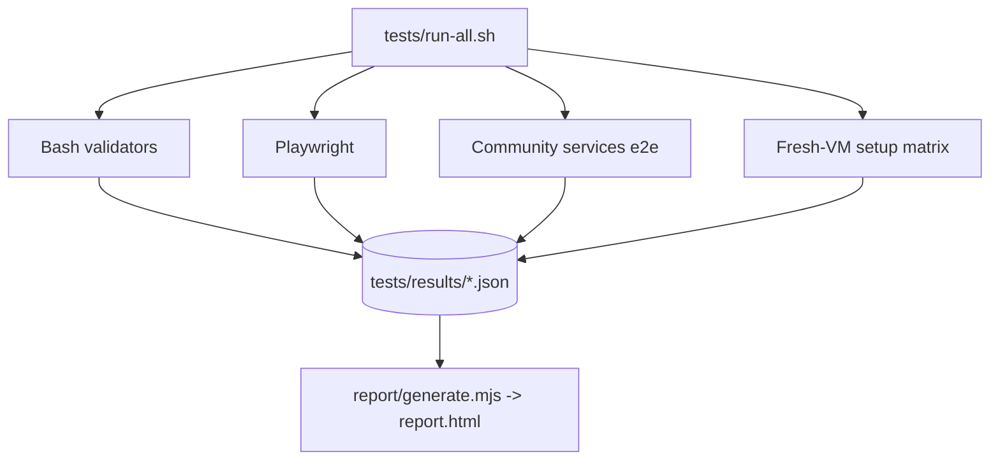

# Val Ark — Test Library

One command runs every suite and produces a single **self-contained, offline HTML
report** you can host anywhere (no internet, no CDN — the same ethos as Val Ark):

```bash
tests/run-all.sh
# -> tests/results/report.html
# host it: (cd tests/results && python3 -m http.server 8099) -> http://<host>:8099/report.html
```

Every suite writes a small JSON file to `tests/results/` in one **common schema**,
and `tests/report/generate.mjs` renders them into the dashboard. That's the whole
contract — add a suite by emitting a matching JSON file.

## Suites

| Suite | What it checks | Where |
|-------|----------------|-------|
| **Bash validators** | host deps, model inventory, TLS/local-CA, tool scripts, upstream mirror URLs, **internal doc-link integrity**, **secret/host-leak scan** | `tests/test-*.sh` |
| **Playwright** | web UI, server API + SSE, install icons, dynamic UI exercise (250+ parametrized) | `tests/screenshots/specs/*.spec.ts` |
| **Community services e2e** | chat/mail/forum/paste status + `/app/<id>/` proxy frames, against a live Ark | `tests/services/run.sh` |
| **Fresh-VM setup** | real setup + web-UI/API smoke on clean Ubuntu 22.04 / 24.04 / 26.04 | `tests/vm/{run,provision}.sh` |



## Running

```bash
# Everything the machine can do (Playwright always; services e2e if an Ark answers)
tests/run-all.sh

# Point the services e2e at a specific Ark (LAN or tailnet)
VALARK_URL=http://<ark-host>:3000 tests/run-all.sh

# Also run the fresh-VM matrix (slow — boots real VMs via multipass + KVM)
VALARK_RUN_VM=1 tests/run-all.sh
VALARK_VM_VERSIONS="24.04" VALARK_RUN_VM=1 tests/run-all.sh   # one version

# Skip the browser suite
VALARK_NO_PLAYWRIGHT=1 tests/run-all.sh
```

Individual suites (each writes its own result file + runs standalone):

```bash
cd tests/screenshots && npx playwright test            # browser suite
VALARK_URL=http://127.0.0.1:3000 tests/services/run.sh
VALARK_VM_VERSIONS="22.04 24.04 26.04" tests/vm/run.sh
node tests/report/generate.mjs                          # (re)render report from results/
```

## Layout

```
tests/
  run-all.sh              # orchestrator -> runs suites + renders the report
  test-*.sh               # bash validators
  lib/results.sh          # shared: results_init / results_case / results_run / results_finish
  services/run.sh         # community-services e2e (target = VALARK_URL)
  vm/run.sh, provision.sh # fresh-Ubuntu setup matrix (multipass); provisioner runs inside the VM
  report/generate.mjs     # results/*.json -> self-contained report.html
  report/from-playwright.mjs   # Playwright JSON -> common schema
  screenshots/specs/      # Playwright specs
  results/                # generated (git-ignored): per-suite JSON + report.html
```

## Common result schema

```json
{
  "suite": "services-e2e",
  "title": "Community services (e2e @ http://<ark-host>:3000)",
  "generated": "2026-07-12 03:58:23 UTC",
  "summary": { "passed": 8, "failed": 0, "skipped": 1, "durationMs": 0 },
  "cases": [ { "name": "forum: /app/forum/ frame reachable", "status": "passed", "durationMs": 0, "detail": "" } ]
}
```

`status` is one of `passed | failed | skipped`. Bash suites produce it via
`tests/lib/results.sh`; Playwright via `tests/report/from-playwright.mjs`.

## Notes

- **Playwright source of truth:** `web-ui.spec.ts` `TOOL_IDS` lists every mirrored
  tool — each must have a card, detail page, icon/logo, and a `scripts/tools/<id>.sh`.
  `install-icons.spec.ts` cross-checks the scripts ↔ `server.js VALID_TOOL_TARGETS`.
- **Test server:** `playwright.config.ts` starts `scripts/server.js` on port **3001**
  (reused if already running). Production defaults to `VALARK_WEB_PORT` (3000).
- **File + server modes:** web-UI tests pass both as a static `file://` page and
  API-connected through the test server — the offline-first, online-optional design.
- **Requirements:** `node` (bundled/mirrored is fine); Playwright deps
  (`cd tests/screenshots && npm install`); and for the VM matrix, `multipass` + KVM.

---

[Back to Project Root](../README.md) · [Architecture](../docs/ARCHITECTURE.md) · [Playwright Config](screenshots/playwright.config.ts)
