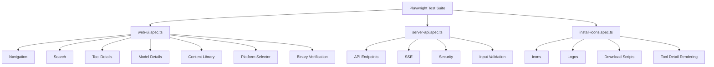

# Tests

This project includes 211 Playwright tests covering web UI, server API, tool scripts, and binary verification.

## Test Coverage



## How to Run

Via menu:
```bash
./start.sh screenshots
```

Direct execution:
```bash
cd tests/screenshots && npx playwright test
```

Interactive mode:
```bash
cd tests/screenshots && npx playwright test --ui
```

## Test Server

The Playwright configuration (`playwright.config.ts`) automatically starts `server.js` on port 3001 before tests run. It uses `reuseExistingServer: true`, so if a server is already running on that port, it will be used instead of launching a new one.

## File and Server Modes

Tests work in both file:// mode (static HTML opened directly) and server mode (API-connected via the test server on port 3001). This ensures the UI functions correctly whether served statically or through the Node.js backend.

---

[Back to Project Root](../README.md) | [Playwright Config](screenshots/playwright.config.ts)
