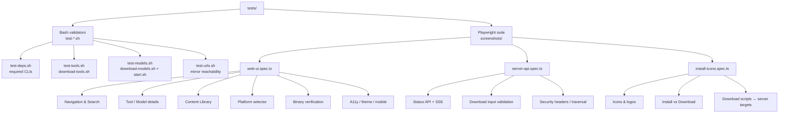

# Tests

Two complementary test layers guard Val Ark:

| Layer | Location | What it checks |
|-------|----------|----------------|
| **Bash validators** | `test-*.sh` | Host deps, script syntax, mirror URL reachability |
| **Playwright suite** | `screenshots/` | Web UI, server API + SSE, install icons, binary verification (200+ tests) |

## Test Coverage



## How to Run

**Bash validators** (fast, no Node required) — also wired into `./start.sh test`:
```bash
./tests/run-all.sh
```

**Playwright suite:**
```bash
export PATH="$HOME/.local/node/bin:$PATH"
cd tests/screenshots && npx playwright test          # all specs
cd tests/screenshots && npx playwright test --ui     # interactive
```

The same suite drives screenshot capture via `./scripts/screenshots.sh web`.

## What the Layers Cover

**Bash validators** confirm the host has `wget/curl/git/tar/bash`, that the
download scripts parse and self-describe, and that a sampling of upstream mirror
URLs is reachable (with retry/backoff so GitHub rate-limits don't flap a pass).

**Playwright suite** exercises the live web UI and `server.js` API. The
`web-ui.spec.ts` `TOOL_IDS` array is the source of truth for the **43** mirrored
tools — every tool must have a card, detail page, icon/logo, and a matching
`scripts/tools/<id>.sh`. `install-icons.spec.ts` cross-checks that each tool
script exists, sources `_common.sh`, and is listed in `server.js`
`VALID_TOOL_TARGETS`. `server-api.spec.ts` validates the status endpoints, the
SSE download stream, input validation, path-traversal blocking, and security
headers.

## Test Server

`playwright.config.ts` starts `scripts/server.js` on port **3001** before the
suite runs. With `reuseExistingServer: true`, an already-running server on that
port is reused instead. (Production defaults to `VALARK_WEB_PORT`, 3000.)

## File and Server Modes

Web-UI tests pass in both `file://` mode (static HTML opened directly) and
server mode (API-connected via the test server). This keeps the UI working
whether shipped as a static page or served through the Node backend — important
for the offline-first, online-optional design.

---

[Back to Project Root](../README.md) · [Architecture](../docs/ARCHITECTURE.md) · [Playwright Config](screenshots/playwright.config.ts)
