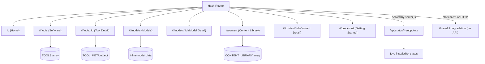

# Web UI

Single-page application contained entirely in one `index.html` file.
No build step, no npm, no bundler -- just open the file in a browser.
Navigation uses hash-based routing (`window.location.hash`) with a
`hashchange` listener that calls a central `router()` function.

## Page Structure



The app works fully offline as a static file (`file://` protocol). When
served by `server.js`, it additionally fetches `/api/status/tools`,
`/api/status/content`, `/api/status/disk`, and `/api/status/all` to show
real-time installation and disk-usage information.

## Data Model

**TOOLS array** -- each entry contains:
`id`, `name`, `category`, `icon`, `iconBg`, `logo`, `desc`, `platforms`,
`downloads` (source/releases/binaries), and `details` (overview, features).

**TOOL_META object** -- keyed by tool id, provides:
`license`, `licenseUrl`, `maker`, `website`.

**CONTENT_LIBRARY array** -- offline ZIM files for Kiwix, each with:
`id`, `name`, `category`, `size`, `file`, `source`, `articles`, `details`.

### Tool Categories

| ID | Label |
|----|-------|
| `ai-inference` | AI Inference |
| `ai-platform` | AI Platform |
| `creative` | Creative |
| `media` | Media |
| `infrastructure` | Infrastructure |
| `dev-tools` | Dev Tools |

## File Structure

```
web-ui/
  index.html      -- the entire application (HTML + CSS + JS)
  logos/           -- SVG/PNG tool logos
  screenshots/    -- tool screenshots
  diagrams/       -- architecture diagrams
  assets/         -- additional static assets
```

## Running

1. **Static** -- open `index.html` directly in a browser (`file://`).
2. **Via server** -- run `node server.js` from the project root; the UI
   is served at `http://localhost:<port>` with live API status endpoints.

---

[Back to Project Root](../README.md)
