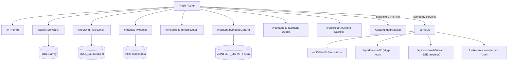

# Web UI

A no-build single-page app. Markup and logic live in `index.html`; styling
is in a separate `styles.css`. No npm, no bundler -- open the file in a
browser. Navigation uses hash-based routing (`window.location.hash`) with a
`hashchange` listener that calls a central `router()` function.

## Page Structure



The app works fully offline as a static file (`file://`). When served by
[`scripts/server.js`](../scripts/server.js) (zero-dependency Node) it adds a
JSON API and live data:

| Endpoint (family) | Purpose |
|-------------------|---------|
| `GET /api/status/{all,tools,models,content,kiwix,disk,health,metrics,metrics/history,notifications,services,moderation,ask,tls}` | Live status (read-gated) |
| `GET /api/catalog/{content,models}` | Browse feed of not-yet-mirrored items |
| `POST /api/request` | One-click mirror a single item (footprint-capped) |
| `POST /api/service/start` | Start a community service |
| `POST /api/ask` · `GET /api/status/ask` | Ask Val Ark — SSE answer from the on-box LLM |
| `GET /api/packages` | On-disk app/tool inventory (Library ▸ Downloads) |
| `GET /api/download/{tools,models,content,update,cancel}` · `/api/downloads/stream` | Trigger mirror jobs · SSE progress |
| `POST /api/maintenance/repair` | Admin-only one-click self-heal |
| `GET /api/health` | Server liveness |

`scripts/server.js` is the authoritative endpoint list (see
[`../scripts/AGENTS.md`](../scripts/AGENTS.md)) — this table is a representative subset.

The server also auto-launches `kiwix-serve` for any complete `.zim` it finds
in `content/zim`, so offline encyclopedias work without manual setup. Without
the server, the UI degrades gracefully (no live status, static data only).

## Data Model

**TOOLS array** -- one entry per tool across the seven `TOOL_CATEGORIES` (see below).
The catalog is the source of truth for the count: the `TOOLS` array here, mirrored by
`TOOL_IDS` in [`../tests/screenshots/specs/web-ui.spec.ts`](../tests/screenshots/specs/web-ui.spec.ts),
which the Playwright suite asserts card-for-card. Each entry carries:
`id`, `name`, `category`, `icon`, `iconBg`, `logo`, `desc`, `platforms`,
`downloads` (source/releases/binaries), and `details` (overview, features).
Per-platform status for the aarch64 aliases (Thor, GB10) and OpenWRT is
derived at runtime by `deriveToolPlatforms()`, so each tool only declares its
base `jetson`/`ubuntu`/`mac`/`windows` status.

**TOOL_META object** -- keyed by tool id: `license`, `licenseUrl`, `maker`,
`website`.

**CONTENT_LIBRARY array** -- offline ZIM files for Kiwix, each with:
`id`, `name`, `category`, `size`, `file`, `source`, `articles`, `details`.

### Tool Categories (`TOOL_CATEGORIES`)

| ID | Label |
|----|-------|
| `ai-inference` | AI Inference |
| `ai-platform` | AI Platform |
| `creative` | Creative & Engineering |
| `media` | Media |
| `community` | Community & Comms |
| `infrastructure` | Infrastructure |
| `dev-tools` | Dev Tools |

### Platforms (`PLATFORMS`)

Selectable in the UI: `jetson` (Jetson Orin), `thor` (Jetson Thor), `gb10`
(GB10 Grace-Blackwell), `ubuntu`, `mac`, `windows`, `openwrt`. All aarch64
boards share the `linux-arm64` artifacts and differ only by GPU/CUDA profile;
OpenWRT routers expose the content/sync/infra subset only.

## File Structure

```
web-ui/
  index.html     -- markup + application logic (HTML + JS)
  styles.css     -- all styling (linked from index.html)
  logos/         -- SVG/PNG tool logos
  screenshots/   -- tool screenshots
  samples/       -- sample prompts / text used by detail pages
  AGENTS.md      -- code-level navigation map (section -> line index)
  README.md      -- this file
```

For a section-by-section map of `index.html` (which `render*` function lives where) and
the two non-negotiable rules (zero-dependency; `escAttr()` for attribute values), see
[`AGENTS.md`](AGENTS.md).

## Running

1. **Static** -- open `index.html` directly in a browser (`file://`).
2. **Via server** -- `node ../scripts/server.js [port]` (default `3000`), or
   `./start.sh serve [port]` from the project root. The 24/7 loop and verify
   scripts honor `VALARK_WEB_PORT` (set in `.env`) when launching the server.

---

[Repo root](../README.md) · [Navigation map](AGENTS.md) · [server.js](../scripts/server.js) · [Playwright specs](../tests/screenshots/AGENTS.md)
